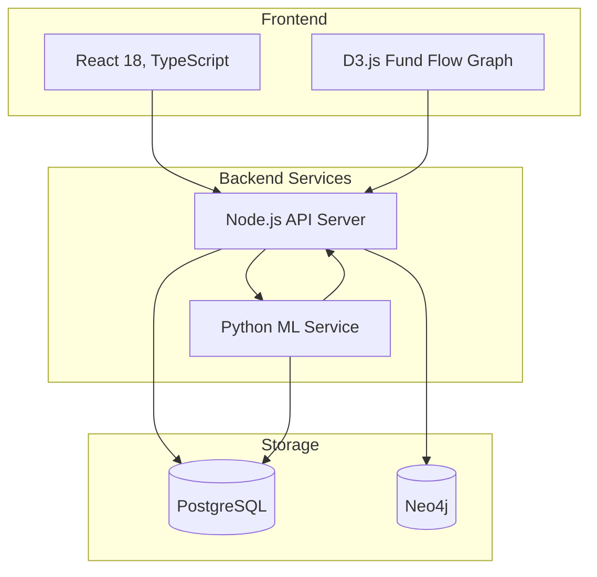

# GraphSentinel

## 1. Problem Statement
Traditional Anti-Money Laundering (AML) systems heavily rely on static, rule-based heuristics that are increasingly inadequate against modern, sophisticated financial crimes. Illicit actors use complex obfuscation techniques such as multi-hop layering, circular round trips, and structuring (smurfing) to evade detection. These legacy systems suffer from notoriously high false-positive rates, overwhelming investigators and allowing subtle, temporally distributed fraud patterns to slip through undetected. The challenge lies in accurately capturing both the structural complexity of transaction networks and the temporal sequence of account behaviors simultaneously, while preserving cross-bank data privacy.

## 2. Solution Overview
GraphSentinel is a production-grade, distributed financial fraud detection and AML platform. It leverages an ensemble of Graph Neural Networks (GNNs) and Sequence Models to detect multi-hop illicit financial activities in real-time. Target latency is sub-second alert generation.

## 3. Key Innovations
Our key innovation is a Federated Learning Architecture that allows multiple Public Sector Banks (PSBs) to train a shared intelligence model without ever sharing raw PII or transaction data, maintaining strict RBI data localization compliance.

## 4. Architecture Diagram


## 5. Core Architecture
GraphSentinel employs a massive-scale, dual-pipeline machine learning architecture. It is designed for 10M+ transactions per day projected throughput:

- Real-Time Data Ingestion: Powered by Apache Kafka and Apache Flink for asynchronous queuing and stateful stream processing.
- Graph Database: Transactions are synced into Neo4j, enabling sub-millisecond property graph traversals and DFS-based cycle detection on sliding 6-hour windows.
- Graph Modeling (PyTorch Geometric): An ensemble of three GNN architectures:
  - EvolveGCN: Captures dynamic network topology over time.
  - GAT (Graph Attention Network): Focuses on high-risk nodes and jurisdictions.
  - GraphSAGE: Enables inductive learning for newly created accounts.
- Behavioral ML (LSTM Autoencoder): Analyzes 12-month transaction sequences for behavioral profiling, identifying frequency surges and volume anomalies.
- Explainable AI (SHAP): Generates mathematically-grounded Shapley values, rendering plain-English causal narratives for every alert to assist investigators.

## 6. Technology Stack
| Component | Technology Used |
| :--- | :--- |
| Frontend | React 18, TypeScript, TailwindCSS |
| Graph Visualization | D3.js (Interactive fund flow visualization) |
| Backend API | FastAPI (Python) + Node.js Microservices |
| Caching Layer | Redis (for sub-second query performance) |
| Relational Storage | PostgreSQL (Supabase) |
| Graph Database | Neo4j (Cypher queries) |
| Data Streaming | Apache Kafka, Apache Flink |
| ML Framework | PyTorch Geometric (PyG), TensorFlow |
| Federated Learning | PySyft, Flower (Differential privacy noise) |
| Deployment | Docker, Kubernetes (K8s) |

## 7. Features
- Federated Intelligence Sharing: Gradient-only sharing across participating banks via PySyft. No PII ever leaves the host bank.
- DFS Cycle Detection: Real-time DFS graph traversals catching Circular Round-Trips (75% recovery ratio) instantly at the database layer.
- Rule-Based Engine: Works alongside the ML model to catch deterministic fraud immediately:
  - Multi-hop layering (3 hops, 90% forward ratio)
  - Structuring/Smurfing (Sub-threshold clustering)
  - Dormant Reactivation (180 days dormancy, 5L outbound)
  - KYC Mismatch (80 Lakhs volume AND 50x declared income)
- Live FIU-IND Integration: Connects to the goAML API for auto-generated STR/CTR XML package submission.
- Investigator Dashboard: Priority queue for investigators with a built-in feedback to retraining loop.

## 8. ML Pipeline
- Data Preparation
- Graph Construction
- Feature Engineering
- Training
- Inference
- Feedback Retraining

## 9. Security & Compliance
- RBI Data Localization
- PMLA Compliance
- FIU-IND goAML Reporting
- Differential Privacy
- End-to-End Encryption
- Audit Logging

## 10. Scalability
- Designed for 10M+ transactions per day
- Horizontal Kubernetes scaling
- Kafka partitioning
- Neo4j clustering
- Redis caching

## 11. Quickstart
Note: The following instructions spin up the lightweight, monolithic evaluation version of GraphSentinel for local testing and demonstrations. The full Kubernetes/Kafka distributed deployment requires the enterprise Helm charts.

### Prerequisites
- Node.js (v18+)
- Python (v3.9+)
- A Supabase project (Postgres)

### 1) Create the Supabase schema + demo seed
Run these migrations in your Supabase project (SQL editor), in order:
- supabase/migrations/20260504215226_create_graphsentinel_schema.sql
- supabase/migrations/20260504215539_seed_graphsentinel_data.sql

### 2) Configure environment variables
Create a root .env (the backend also reads this file):
```env
VITE_SUPABASE_URL=your-supabase-project-url
VITE_SUPABASE_ANON_KEY=your-supabase-anon-key
SUPABASE_URL=your-supabase-project-url
SUPABASE_ANON_KEY=your-supabase-anon-key
ML_SERVICE_URL=http://127.0.0.1:8790
PORT=8787
CORS_ORIGIN=http://localhost:5174
```

### 3) Install dependencies
```bash
npm install
python3 -m pip install --upgrade pip
python3 -m pip install tensorflow numpy
```

### 4) Run everything
```bash
npm run start:all
```

## 12. API Documentation
The Node.js server exposes RESTful endpoints for integration:

Health checks:
```bash
curl http://localhost:8787/health
curl http://127.0.0.1:8790/health
```

Trigger ML analysis & persist new alerts:
```bash
curl -X POST http://localhost:8787/api/analyze
```

Generate goAML XML report:
```bash
curl -X POST http://localhost:8787/api/reports/generate \
  -H "Content-Type: application/json" \
  -d '{"reportType":"STR","narrative":"Generated from open alerts"}'
```

Submit investigator feedback (stored for retraining):
```bash
curl -X POST http://localhost:8787/api/feedback \
  -H "Content-Type: application/json" \
  -d '{"alert_id":"ALRT_XXXXXXXX","status":"confirmed","investigator_action":"confirmed","investigator_name":"Investigations Desk","notes":"Clear layering pattern."}'
```

## 13. Deployment
- Frontend: Vercel
- Backend: Docker, Kubernetes
- Database: PostgreSQL / Supabase
- Graph Layer: Neo4j
- Streaming: Kafka + Flink
- ML Service: TensorFlow/PyTorch container
- Monitoring: Prometheus, Grafana

## 14. Business Impact
- Expected reduction in AML false positives
- Faster investigator workflows
- Automated STR generation
- Better regulatory compliance
- Cross-bank fraud visibility

## 15. Future Roadmap
- Phase 1: Single-bank deployment
- Phase 2: Multi-bank federation
- Phase 3: RBI/FIU integration
- Phase 4: Cross-border AML detection

## 16. Contributors
GraphSentinel Development Team

## 17. License
MIT License
