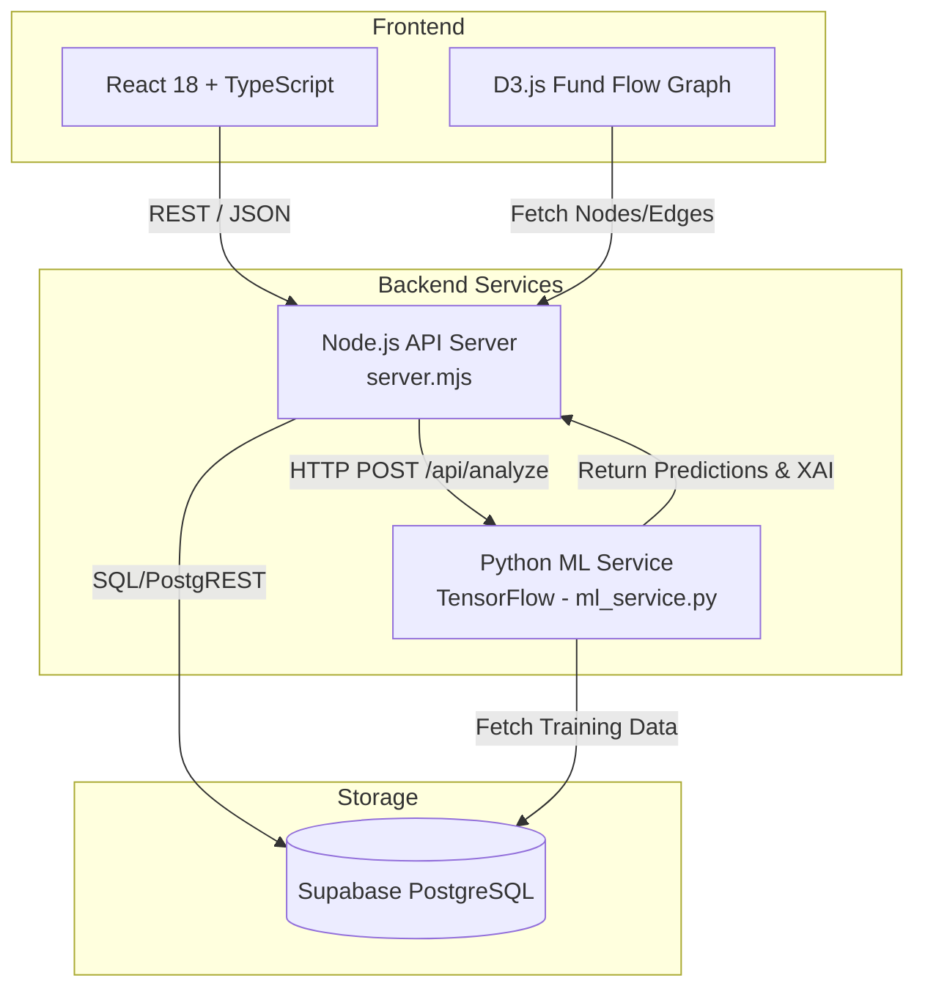

# TokenCap Snapshot

| Field | Value |
| --- | --- |
| Generated | 2026-05-26T16:16:30.592Z |
| Workspace | /Users/sagaragarwal/graph sentinel |
| Profile | balanced |
| Selected files | 28 |
| Source bytes | 219571 |
| Estimated tokens | 57055 |

## Read First

This file is a compressed coding-session handoff. Read it before editing, then inspect the referenced files directly. Prefer the live repository over this snapshot when there is a conflict.

## Handoff Summary

| Field | Value |
| --- | --- |
| Read order | src/pages/TransactionSimulator.tsx > backend/ml_artifacts/graphsentinel_meta.json > backend/server.mjs > backend/ml_service.py > README.md |
| Primary anchors | src/pages/TransactionSimulator.tsx, backend/ml_artifacts/graphsentinel_meta.json, backend/server.mjs |
| Changed files | 6 |
| TODO notes | 0 |
| File budget used | 31% |
| Source budget used | 100% |
| Token estimate | 57055 |
| Contents mode | enabled |

## Operating Rules For The Next Agent

- Preserve user changes and do not revert unrelated work.
- Start with changed files and files marked `high-signal` in the manifest.
- Use the Git diff as intent, not as a complete source of truth.
- Refresh this capsule after meaningful edits or before ending the session.

## Git Snapshot

| Field | Value |
| --- | --- |
| Branch | main |
| Git root | /Users/sagaragarwal/graph sentinel |

Recent commits:
```text
2c581f4 c27
91e3179 c9
8b32223 first commit
```

Status:
```text
 M backend/ml_artifacts/graphsentinel_meta.json
 M backend/ml_artifacts/graphsentinel_model.keras
 M backend/ml_service.py
 M backend/server.mjs
 M src/pages/TransactionSimulator.tsx
?? GraphSentinel_PS3_iDEA2.0.pdf
```

## Project Map

```text
backend/
backend/lib/
backend/ml_artifacts/
src/
src/components/
src/lib/
src/pages/
supabase/
supabase/migrations/
.env
COMPONENT_CODE_SNIPPETS.md
IMPLEMENTATION_GUIDE.md
README.md
UI_FEATURES_GUIDE.md
backend/.env.example
backend/lib/detection.mjs
backend/lib/goaml.mjs
backend/lib/supabase.mjs
backend/ml_artifacts/graphsentinel_meta.json
backend/ml_service.py
backend/server.mjs
eslint.config.js
index.html
package.json
postcss.config.js
src/App.tsx
src/components/Layout.tsx
src/index.css
src/lib/api.ts
src/lib/exportUtils.ts
src/lib/formatters.ts
src/lib/goaml.ts
src/lib/supabase.ts
src/main.tsx
src/pages/Dashboard.tsx
src/pages/FederatedNetwork.tsx
src/pages/FraudAlerts.tsx
src/pages/FundFlowGraph.tsx
src/pages/Reports.tsx
src/pages/Settings.tsx
src/pages/TransactionSimulator.tsx
src/vite-env.d.ts
supabase/migrations/20260504215226_create_graphsentinel_schema.sql
supabase/migrations/20260504215539_seed_graphsentinel_data.sql
tailwind.config.js
tsconfig.app.json
tsconfig.json
tsconfig.node.json
vite.config.ts
```

## File Manifest

| File | Bytes | Score | Why |
| --- | ---: | ---: | --- |
| src/pages/TransactionSimulator.tsx | 22247 | 149 | changed, source |
| backend/ml_artifacts/graphsentinel_meta.json | 986 | 120 | changed |
| backend/server.mjs | 17878 | 119 | changed |
| backend/ml_service.py | 33138 | 118 | changed |
| README.md | 7739 | 105 | project-metadata, high-signal-doc |
| package.json | 1365 | 70 | project-metadata |
| tsconfig.json | 119 | 70 | project-metadata |
| vite.config.ts | 220 | 70 | project-metadata |
| src/App.tsx | 1157 | 30 | source |
| src/components/Layout.tsx | 9160 | 30 | source |
| src/index.css | 7715 | 30 | source |
| src/lib/api.ts | 4419 | 30 | source |
| src/lib/exportUtils.ts | 4489 | 30 | source |
| src/lib/formatters.ts | 3707 | 30 | source |
| src/lib/goaml.ts | 4421 | 30 | source |
| src/lib/supabase.ts | 2535 | 30 | source |
| src/main.tsx | 234 | 30 | source |
| src/vite-env.d.ts | 38 | 30 | source |
| src/pages/Dashboard.tsx | 14590 | 29 | source |
| src/pages/FederatedNetwork.tsx | 18021 | 29 | source |
| src/pages/FraudAlerts.tsx | 22008 | 29 | source |
| src/pages/FundFlowGraph.tsx | 23464 | 29 | source |
| src/pages/Settings.tsx | 13951 | 29 | source |
| .env | 128 | 0 | context |
| backend/.env.example | 121 | 0 | context |
| backend/lib/goaml.mjs | 4901 | 0 | context |
| eslint.config.js | 739 | 0 | context |
| postcss.config.js | 81 | 0 | context |

## Changed Files

-  M backend/ml_artifacts/graphsentinel_meta.json
-  M backend/ml_artifacts/graphsentinel_model.keras
-  M backend/ml_service.py
-  M backend/server.mjs
-  M src/pages/TransactionSimulator.tsx
- ?? GraphSentinel_PS3_iDEA2.0.pdf

## Git Diff Snippets

### Unstaged Changes Diff

```diff
diff --git a/backend/ml_artifacts/graphsentinel_meta.json b/backend/ml_artifacts/graphsentinel_meta.json
index b5d16d8..779c6ba 100644
--- a/backend/ml_artifacts/graphsentinel_meta.json
+++ b/backend/ml_artifacts/graphsentinel_meta.json
@@ -1,49 +1,49 @@
 {
   "seq_mean": [
-    0.10089770704507828,
-    13.327795028686523,
-    0.0,
-    0.212382972240448,
+    0.1182762160897255,
+    6.6833624839782715,
+    -0.007092198356986046,
+    0.24976827204227448,
     0.06471630930900574,
-    0.032801419496536255,
-    0.030141843482851982,
+    0.03235815465450287,
+    0.053634751588106155,
     0.0,
     0.0,
-    0.05055849626660347,
-    0.39603644609451294
+    0.05906917527318001,
+    0.5837340950965881
   ],
   "seq_std": [
-    0.26882728934288025,
-    446.4341125488281,
-    0.35729479789733887,
-    1.2100352048873901,
-    0.24602414667606354,
-    0.17811602354049683,
-    0.1709761917591095,
+    0.28545182943344116,
+    315.74163818359375,
+    0.3881503641605377,
+    1.4717670679092407,
+    0.24602416157722473,
+    0.17694717645645142,
+    0.22529464960098267,
     0.0,
     0.0,
-    0.1696527749300003,
-    1.2834745645523071
+    0.18044023215770721,
+    1.7425448894500732
   ],
   "graph_mean": [
-    15033.759765625,
-    1.4299981594085693,
-    1.0799970626831055,
-    1.2000001668930054,
-    0.42911046743392944,
-    0.05398615449666977,
-    0.008947085589170456,
-    0.33367159962654114
+    15056.171875,
+    2.039996385574341,
+    1.0700016021728516,
+    1.2300018072128296,
+    0.3278597593307495,
+    0.06510980427265167,
+    0.018799079582095146,
+    0.5618855953216553
   ],
   "graph_std": [
-    45060.92578125,
-    1.565279483795166,
-    1.0293688774108887,
-    1.2091326713562012,
-    0.32996901869773865,
-    0.10599450767040253,
-    0.019827228039503098,
-    0.3570656180381775
+    45054.50390625,
+    2.185955286026001,
+    1.195029854774475,
+    1.3638534545898438,
+    0.28825199604034424,
+    0.0918915867805481,
+    0.03351123258471489,
+    1.0985417366027832
   ],
-  "version": "2026-05-08T21:17:17.644240Z"
+  "version": "2026-05-23T11:10:34.584002Z"
 }
\ No newline at end of file
diff --git a/backend/ml_artifacts/graphsentinel_model.keras b/backend/ml_artifacts/graphsentinel_model.keras
index 44b50d0..b4e16b1 100644
Binary files a/backend/ml_artifacts/graphsentinel_model.keras and b/backend/ml_artifacts/graphsentinel_model.keras differ
diff --git a/backend/ml_service.py b/backend/ml_service.py
index 8962415..4a88044 100644
--- a/backend/ml_service.py
+++ b/backend/ml_service.py
@@ -529,6 +529,14 @@ def train_model(payload: dict[str, Any]) -> dict[str, Any]:
                     elif fb.get("investigator_action") == "dismissed":
                         sample_weights[index] = 0.7
 
+    # Apply class balancing so the model doesn't just predict the majority class (e.g. kyc_mismatch)
+    unique_classes, counts = np.unique(y_array, return_counts=True)
+    if len(unique_classes) > 0:
+        total_samples = len(y_array)
+        class_weight_dict = {cls: total_samples / (len(unique_classes) * count) for cls, count in zip(unique_classes, counts)}
+        for i in range(len(y_array)):
+            sample_weights[i] *= class_weight_dict[y_array[i]]
+
     epochs = int(payload.get("epochs", 5))
     history = model.fit(
         [graph_array, seq_array],
@@ -605,20 +613,18 @@ def compute_integrated_gradients(
     seq_interp  = baseline_seq + alpha_seq[:, None, None] * (seq_input - baseline_seq)
     graph_interp = baseline_graph + alpha_seq[:, None, None] * (graph_input - baseline_graph)
 
-    all_gs, all_gg = [], []
-    for i in range(steps + 1):
-        s = tf.constant(seq_interp[i : i + 1])
-        g = tf.constant(graph_interp[i : i + 1])
-        with tf.GradientTape() as tape:
-            tape.watch([s, g])
-            preds, _ = model([g, s], training=False)
-            target = preds[0, class_index]
-        gs, gg = tape.gradient(target, [s, g])
-        all_gs.append(gs.numpy()[0])
-        all_gg.append(gg.numpy()[0])
-
-    avg_gs = np.mean(all_gs, axis=0)   # (SEQ_LEN, SEQ_FEATURES)
-    avg_gg = np.mean(all_gg, axis=0)   # (GRAPH_STEPS, GRAPH_FEATURES)
+    # Process all steps in a single batch to avoid tf.function retracing and speed up execution
+    s = tf.constant(seq_interp)
+    g = tf.constant(graph_interp)
+    with tf.GradientTape() as tape:
+        tape.watch([s, g])
+        preds, _ = model([g, s], training=False)
+        target = preds[:, class_index]
+    
+    gs, gg = tape.gradient(target, [s, g])
+    
+    avg_gs = np.mean(gs.numpy(), axis=0)   # (SEQ_LEN, SEQ_FEATURES)
+    avg_gg = np.mean(gg.numpy(), axis=0)   # (GRAPH_STEPS, GRAPH_FEATURES)
 
     ig_seq   = (seq_input[0]   - baseline_seq[0])   * avg_gs
     ig_graph = (graph_input[0] - baseline_graph[0]) * avg_gg
diff --git a/backend/server.mjs b/backend/server.mjs
index 0ee7b7d..226ebe5 100644
--- a/backend/server.mjs
+++ b/backend/server.mjs
@@ -2,7 +2,7 @@ import { createServer } from 'node:http';
 import { URL } from 'node:url';
 import { createSupabaseClient } from './lib/supabase.mjs';
 import { generateGoamlXml } from './lib/goaml.mjs';
-import { summarizeDashboard, summarizeGraph } from './lib/detection.mjs';
+import { detectFraudAlerts, summarizeDashboard, summarizeGraph } from './lib/detection.mjs';
 
 const PORT = Number(process.env.PORT || 8787);
 const CORS_ORIGIN = process.env.CORS_ORIGIN || '*';
@@ -125,7 +125,8 @@ async function deduplicateAlerts(newAlerts) {
     const duplicate = recentOpen.find(
       (a) =>
         a.pattern_type === alert.pattern_type &&
-        (a.involved_accounts || []).some((id) => newAccounts.has(id)),
+        (a.involved_accounts || []).some((id) => newAccounts.has(id)) &&
+        alert.linked_transaction_ids.every((id) => (a.linked_transaction_ids || []).includes(id))
     );
 
     if (duplicate) {
@@ -245,16 +246,10 @@ async function handleRequest(req, res) {
         };
 
         const inserted = await supabase.insert('transactions', [payload]);
-        const dataset = await loadDataset();
-        const analysis = await analyzeWithMlService({
-          accounts: dataset.accounts,
-          transactions: dataset.transactions,
-          patterns: dataset.patterns,
-        });
 
         jsonResponse(res, 201, {
           transaction: inserted?.[0] || payload,
-          alerts: analysis.alerts || [],
+          alerts: [],
         });
         return;
       }
@@ -330,13 +325,20 @@ async function handleRequest(req, res) {
 
     if (url.pathname === '/api/analyze') {
       const dataset = await loadDataset();
+      
+      const ruleAlerts = detectFraudAlerts({
+        accounts: dataset.accounts,
+        transactions: dataset.transactions,
+        patterns: dataset.patterns,
+      });
+
       const analysis = await analyzeWithMlService({
         accounts: dataset.accounts,
         transactions: dataset.transactions,
         patterns: dataset.patterns,
       });
 
-      const rawAlerts = analysis.alerts || [];
+      const rawAlerts = [...ruleAlerts, ...(analysis.alerts || [])];
       const { toInsert, toUpdate } = await deduplicateAlerts(rawAlerts);
 
       // Persist net-new alerts
diff --git a/src/pages/TransactionSimulator.tsx b/src/pages/TransactionSimulator.tsx
index 5ce1556..a664fa8 100644
--- a/src/pages/TransactionSimulator.tsx
+++ b/src/pages/TransactionSimulator.tsx
@@ -131,10 +131,20 @@ export default function TransactionSimulator() {
 
       // Find if any alert involves sender or receiver accounts in this submission
       const activeAccountIds = new Set(transactionsToPost.flatMap(t => [t.sender_account_id, t.receiver_account_id]));
-      const matchingAlert = (analysis.alerts || []).find(alert => 
+      // If a preset was used, prioritize finding the alert type that matches the preset.
+      // (Otherwise, high-value transfers might trigger a 94% KYC Mismatch that overshadows the intended 90% Layering alert)
+      let matchingAlert = (analysis.alerts || []).find((alert: any) => 
+        presetType && alert.pattern_type.includes(presetType) && 
         (alert.involved_accounts || []).some((accId: string) => activeAccountIds.has(accId))
       );
 
+      // Fallback: just find any alert involving these accounts
+      if (!matchingAlert) {
+        matchingAlert = (analysis.alerts || []).find((alert: any) => 
+          (alert.involved_accounts || []).some((accId: string) => activeAccountIds.has(accId))
+        );
+      }
+
       if (matchingAlert) {
         // Parse factors if stringified
         let shapFactors: AlertFactor[] = [];
```

## TODO / FIXME / HACK Notes

No TODO/FIXME/HACK notes found in selected files.

## Selected File Context

### src/pages/TransactionSimulator.tsx

| Field | Value |
| --- | --- |
| Bytes | 22247 |
| Score | 149 |
| Why | changed, source |
| Status | Truncated (budget limit) |

**Structural Outline:**
  - `interface AlertFactor` (line 8)
  - `fn TransactionSimulator` (line 14)
  - `fn load` (line 39)
  - `fn formatPatternName` (line 190)


```tsx
import { useState, useEffect } from 'react';
import { fetchAccounts, postTransaction, triggerAnalysis } from '../lib/api';
import type { Account } from '../lib/supabase';
import { 
  Send, ShieldAlert, CheckCircle2, AlertTriangle, Play, Zap, RefreshCw, BarChart2, CornerDownRight 
} from 'lucide-react';

interface AlertFactor {
  factor: string;
  weight: number;
  direction: string;
}

export default function TransactionSimulator() {
  const [accounts, setAccounts] = useState<Account[]>([]);
  const [loadingAccounts, setLoadingAccounts] = useState(true);
  const [senderId, setSenderId] = useState('');
  const [receiverId, setReceiverId] = useState('');
  const [amount, setAmount] = useState('150000');
  const [channel, setChannel] = useState('NEFT');

  // Simulator Execution state
  const [isSimulating, setIsSimulating] = useState(false);
  const [step, setStep] = useState(0);
  const [result, setResult] = useState<{
    success: boolean;
    txId?: string;
    alertTriggered: boolean;
    alertDetails?: {
      pattern_type: string;
      confidence_score: number;
      shap_narrative: string;
      shap_factors: AlertFactor[];
      severity: string;
    };
  } | null>(null);

  useEffect(() => {
    async function load() {
      try {
        const data = await fetchAccounts();
        setAccounts(data);
        if (data.length > 0) {
          setSenderId(data[0].id);
          setReceiverId(data[1]?.id || data[0].id);
        }
      } catch (err) {
        console.error('Failed to load accounts:', err);
      } finally {
        setLoadingAccounts(false);
      }
    }
    load();
  }, []);

  const handleManualSubmit = async (e: React.FormEvent) => {
    e.preventDefault();
    if (!senderId || !receiverId) return;
    await executeSimulation([
      {
        sender_account_id: senderId,
        receiver_account_id: receiverId,
        amount: Number(amount),
        channel,
      }
    ]);
  };

  const handleScenarioPreset = async (presetType: 'structuring' | 'velocity' | 'layering') => {
    let txs: Array<{ sender_account_id: string; receiver_account_id: string; amount: number; channel: string }> = [];

    // Choose representative accounts from seed or general lists
    const norm = accounts.find(a => a.id.startsWith('ACC_N')) || accounts[0];

    if (presetType === 'structuring') {
      // 3 transactions of 9.8 Lakhs successively from a single account to different recipients
      const targets = accounts.filter(a => a.id !== norm.id).slice(0, 3);
      txs = targets.map(t => ({
        sender_account_id: norm.id,
        receiver_account_id: t.id,
        amount: 980000,
        channel: 'NEFT'
      }));
    } else if (presetType === 'velocity') {
      // 5 rapid transfers of 1.2 Lakhs to the same receiver within UPI
      const receiver = accounts.find(a => a.id !== norm.id) || accounts[1];
      txs = Array.from({ length: 5 }).map(() => ({
        sender_account_id: norm.id,
        receiver_account_id: receiver.id,
        amount: 120000,
        channel: 'UPI'
      }));
    } else if (presetType === 'layering') {
      // Linear hops: A -> B -> C -> D
      const chain = accounts.slice(0, 4);
      if (chain.length >= 4) {
        txs = [
          { sender_account_id: chain[0].id, receiver_account_id: chain[1].id, amount: 5000000, channel: 'RTGS' },
          { sender_account_id: chain[1].id, receiver_account_id: chain[2].id, amount: 4950000, channel: 'RTGS' },
          { sender_account_id: chain[2].id, receiver_account_id: chain[3].id, amount: 4900000, channel: 'RTGS' },
        ];
      }
    }

    if (txs.length > 0) {
      await executeSimulation(txs);
    }
  };

  const executeSimulation = async (transactionsToPost: Array<{ sender_account_id: string; receiver_account_id: string; amount: number; channel: string }>) => {
    setIsSimulating(true);
    setResult(null);
    setStep(1); // Posting transactions

    try {
      let lastTxId = '';
      for (let i = 0; i < transactionsToPost.length; i++) {
        const tx = transactionsToPost[i];
        const res = await postTransaction(tx);
        lastTxId = res.transaction?.id || `TXN_${Date.now()}`;
      }

      await new Promise(r => setTimeout(r, 1000));
      setStep(2); // Analyzing neural networks GCN + LSTM

      await new Promise(r => setTimeout(r, 1200));
      setStep(3); // Running Integrated Gradients Backattribution

      const analysis = await triggerAnalysis();
      await new Promise(r => setTimeout(r, 800));

      // Find if any alert involves sender or receiver accounts in this submission
      const activeAccountIds = new Set(transactionsToPost.flatMap(t => [t.sender_account_id, t.receiver_account_id]));
      // If a preset was used, prioritize finding the alert type that matches the preset.
      // (Otherwise, high-value transfers might trigger a 94% KYC Mismatch that overshadows the intended 90% Layering alert)
      let matchingAlert = (analysis.alerts || []).find((alert: any) => 
        presetType && alert.pattern_type.includes(presetType) && 
        (alert.involved_accounts || []).some((accId: string) => activeAccountIds.has(accId))
      );

      // Fallback: just find any alert involving these accounts
      if (!matchingAlert) {
        matchingAlert = (analysis.alerts || []).find((alert: any) => 
          (alert.involved_accounts || []).some((accId: string) => activeAccountIds.has(accId))
        );
      }

      if (matchingAlert) {
        // Parse factors if stringified
        let shapFactors: AlertFactor[] = [];
        try {
          shapFactors = typeof matchingAlert.shap_factors === 'string' 
            ? JSON.parse(matchingAlert.shap_factors) 
            : (matchingAlert.shap_factors || []);
        } catch {
          shapFactors = [];
        }

        setResult({
          success: true,
          txId: lastTxId,
          alertTriggered: true,
          alertDetails: {
            pattern_type: matchingAlert.pattern_type,
            confidence_score: matchingAlert.confidence_score,
            shap_narrative: matchingAlert.shap_narrative,
            shap_factors: shapFactors,
            severity: matchingAlert.severity || 'high',
          }
        });
      } else {
        setResult({
          success: true,
          txId: lastTxId,
          alertTriggered: false,
        });
      }
    } catch (err) {
      console.error('Simulation error:', err);
      setResult({
        success: false,
        alertTriggered: false,
      });
    } finally {
      setIsSimulating(false);
      setStep(0);
    }
  };

  const formatPatternName = (pattern: string) => {
    return pattern.split('_').map(w => w.charAt(0).toUpperCase() + w.slice(1)).join(' ');
  };

  return (
    <div className="p-6 space-y-6 max-w-6xl mx-auto">
      {/* Introduction Card */}
      <div className="bg-gradient-to-r from-primary to-purple-600 rounded-xl p-6 text-white shadow-lg">
        <h2 className="text-xl font-bold mb-2 flex items-center gap-2">
          <Zap className="w-5 h-5 fill-white" /> Live Transaction Simulation Sandbox
        </h2>
        <p className="text-sm opacity-90 max-w-3xl leading-relaxed">
          Test the limits of GraphSentinel’s machine learning engine in real-time. Conduct individual 
          custom transfers or trigger advanced predefined fraud patterns. Watch the hybrid LSTM + Graph Convolutional Network 
          instantly process ledger updates and construct regulator-defensible Integrated Gradients causal narratives.
        </p>
      </div>

      <div className="grid grid-cols-1 lg:grid-cols-12 gap-6">
        
        {/* Left Column: Form & Presets */}
        <div className="lg:col-span-7 space-y-6">
          
          {/* Preset Fraud Scenarios Card */}
          <div className="bg-white rounded-xl p-5 border border-border shadow-sm">
            <h3 className="text-sm font-semibold text-navy uppercase tracking-wider mb-4 flex items-center gap-2">
              <ShieldAlert className="w-4 h-4 text-primary" /> Trigger Preset Fraud Scenarios
            </h3>
            <div className="grid grid-cols-1 md:grid-cols-3 gap-3">
              <button
                type="button"
                onClick={() => handleScenarioPreset('structuring')}
                disabled={isSimulating || loadingAccounts}
                className="flex flex-col items-start p-4 rounded-lg border border-border hover:border-primary hover:bg-[rgba(83,58,253,0.02)] transition text-left group disabled:opacity-50"
              >
                <span className="text-[13px] font-semibold text-navy group-hover:text-primary transition mb-1 flex items-center gap-1.5">
                  <CornerDownRight className="w-3.5 h-3.5" /> Structuring Pattern
                </span>
                <span className="text-[11px] text-body leading-snug">
                  Triggers 3 back-to-back transfers of ₹9.8 Lakhs (just below limits) from a single node to distinct targets.
                </span>
              </button>

              <button
                type="button"
                onClick={() => handleScenarioPreset('velocity')}
                disabled={isSimulating || loadingAccounts}
                className="flex flex-col items-start p-4 rounded-lg border border-border hover:border-primary hover:bg-[rgba(83,58,253,0.02)] transition text-left group disabled:opacity-50"
              >
                <span className="text-[13px] font-semibold text-navy group-hover:text-primary transition mb-1 flex items-center gap-1.5">
                  <Zap className="w-3.5 h-3.5" /> Velocity Spike
                </span>
                <span className="text-[11px] text-body leading-snug">
                  Launches 5 rapid consecutive UPI transfers within seconds to a single node, triggering anomaly alerts.
                </span>
              </button>

              <button
                type="button"
                onClick={() => handleScenarioPreset('layering')}
                disabled={isSimulating || loadingAccounts}
                className="flex flex-col items-start p-4 rounded-lg border border-border hover:border-primary hover:bg-[rgba(83,58,253,0.02)] transition text-left group disabled:opacity-50"
              >
                <span className="text-[13px] font-semibold text-navy group-hover:text-primary transition mb-1 flex items-center gap-1.5">
                  <Play className="w-3.5 h-3.5" /> Multi-hop Layering
                </span>
                <span className="text-[11px] text-body leading-snug">
                  Initiates a linear multi-hop chain (A → B → C → D) transferring large values rapidly across accounts.
                </span>
              </button>
            </div>
          </div>

          {/* Manual Simulator Form */}
          <div className="bg-white rounded-xl p-5 border border-border shadow-sm">
            <h3 className="text-sm font-semibold text-navy uppercase tracking-wider mb-4 flex items-center gap-2">
              <Send className="w-4 h-4 text-primary" /> Create Manual Transaction
            </h3>
            
            {loadingAccounts ? (
              <div className="flex items-center gap-2 text-sm text-body py-4">
                <RefreshCw className="w-4 h-4 animate-spin" /> Loading ledger accounts...
              </div>
            ) : (
              <form onSubmit={handleManualSubmit} className="space-y-4">
                <div className="grid grid-cols-1 md:grid-cols-2 gap-4">
                  <div>
                    <label className="block text-[11px] font-semibold text-body uppercase tracking-wider mb-1.5">Sender Account</label>
                    <select
                      value={senderId}
                      onChange={(e) => setSenderId(e.target.value)}
                      className="w-full text-sm bg-bg border border-border rounded-md px-3 py-2 text-navy focus:outline-none focus:border-primary"
                    >
                      {accounts.map(acc => (
                        <option key={acc.id} value={acc.id}>
                          {acc.id} - {acc.holder_name} (Risk: {acc.risk_level})
                        </option>
                      ))}
                    </select>
                  </div>

                  <div>
                    <label className="block text-[11px] font-semibold text-body uppercase tracking-wider mb-1.5">Receiver Account</label>
                    <select
                      value={receiverId}
                      onChange={(e) => setReceiverId(e.target.value)}
                      className="w-full text-sm bg-bg border border-border rounded-md px-3 py-2 text-navy focus:outline-none focus:border-primary"
                    >
                      {accounts.map(acc => (
                        <option key={acc.id} value={acc.id}>
                          {acc.id} - {acc.holder_name} (Risk: {acc.risk_level})
                        </option>
                      ))}
                    </select>
                  </div>
                </div>

                <div className="grid grid-cols-1 md:grid-cols-2 gap-4">
                  <div>
                    <label className="block text-[11px] font-semibold text-body uppercase tracking-wider mb-1.5">Amount (INR)</label>
                    <input
                      type="number"
                      value={amount}
                      onChange={(e) => setAmount(e.target.value)}
                      className="w-full text-sm bg-bg border border-border rounded-md px-3 py-2 text-navy focus:outline-none focus:border-primary font-mono"
                      placeholder="Enter transfer amount"
                    />
                  </div>

                  <div>
                    <label className="block text-[11px] font-semibold text-body uppercase tracking-wider mb-1.5">Payment Channel</label>
                    <select
                      value={channel}
                      onChange={(e) => setChannel(e.

/* ...truncated for capsule budget... */
```

### backend/ml_artifacts/graphsentinel_meta.json

| Field | Value |
| --- | --- |
| Bytes | 986 |
| Score | 120 |
| Why | changed |
| Status | Full content |


```json
{
  "seq_mean": [
    0.1182762160897255,
    6.6833624839782715,
    -0.007092198356986046,
    0.24976827204227448,
    0.06471630930900574,
    0.03235815465450287,
    0.053634751588106155,
    0.0,
    0.0,
    0.05906917527318001,
    0.5837340950965881
  ],
  "seq_std": [
    0.28545182943344116,
    315.74163818359375,
    0.3881503641605377,
    1.4717670679092407,
    0.24602416157722473,
    0.17694717645645142,
    0.22529464960098267,
    0.0,
    0.0,
    0.18044023215770721,
    1.7425448894500732
  ],
  "graph_mean": [
    15056.171875,
    2.039996385574341,
    1.0700016021728516,
    1.2300018072128296,
    0.3278597593307495,
    0.06510980427265167,
    0.018799079582095146,
    0.5618855953216553
  ],
  "graph_std": [
    45054.50390625,
    2.185955286026001,
    1.195029854774475,
    1.3638534545898438,
    0.28825199604034424,
    0.0918915867805481,
    0.03351123258471489,
    1.0985417366027832
  ],
  "version": "2026-05-23T11:10:34.584002Z"
}
```

### backend/server.mjs

| Field | Value |
| --- | --- |
| Bytes | 17878 |
| Score | 119 |
| Why | changed |
| Status | Truncated (budget limit) |

**Structural Outline:**
  - `fn jsonResponse` (line 12)
  - `fn textResponse` (line 25)
  - `fn readJsonBody` (line 36)
  - `fn await` (line 39)
  - `fn loadDataset` (line 51)
  - `fn analyzeWithMlService` (line 64)
  - `fn retrainMlService` (line 83)
  - `fn deduplicateAlerts` (line 107)
  - `fn handleRequest` (line 153)


```mjs
import { createServer } from 'node:http';
import { URL } from 'node:url';
import { createSupabaseClient } from './lib/supabase.mjs';
import { generateGoamlXml } from './lib/goaml.mjs';
import { detectFraudAlerts, summarizeDashboard, summarizeGraph } from './lib/detection.mjs';

const PORT = Number(process.env.PORT || 8787);
const CORS_ORIGIN = process.env.CORS_ORIGIN || '*';
const ML_SERVICE_URL = process.env.ML_SERVICE_URL || 'http://127.0.0.1:8790';
const supabase = createSupabaseClient();

function jsonResponse(res, statusCode, payload) {
  const body = JSON.stringify(payload);

  res.writeHead(statusCode, {
    'Content-Type': 'application/json; charset=utf-8',
    'Access-Control-Allow-Origin': CORS_ORIGIN,
    'Access-Control-Allow-Headers': 'Content-Type, Authorization',
    'Access-Control-Allow-Methods': 'GET,POST,PATCH,OPTIONS',
  });

  res.end(body);
}

function textResponse(res, statusCode, payload) {
  res.writeHead(statusCode, {
    'Content-Type': 'text/plain; charset=utf-8',
    'Access-Control-Allow-Origin': CORS_ORIGIN,
    'Access-Control-Allow-Headers': 'Content-Type, Authorization',
    'Access-Control-Allow-Methods': 'GET,POST,PATCH,OPTIONS',
  });

  res.end(payload);
}

async function readJsonBody(req) {
  const chunks = [];

  for await (const chunk of req) {
    chunks.push(chunk);
  }

  if (chunks.length === 0) {
    return {};
  }

  const bodyText = Buffer.concat(chunks).toString('utf8');
  return bodyText ? JSON.parse(bodyText) : {};
}

async function loadDataset() {
  const [accounts, transactions, alerts, reports, patterns, nodes] = await Promise.all([
    supabase.select('accounts', { order: { column: 'created_at', ascending: true }, limit: 1000 }),
    supabase.select('transactions', { order: { column: 'timestamp', ascending: true }, limit: 5000 }),
    supabase.select('fraud_alerts', { order: { column: 'created_at', ascending: false }, limit: 1000 }),
    supabase.select('str_ctr_reports', { order: { column: 'created_at', ascending: false }, limit: 1000 }),
    supabase.select('fraud_patterns', { order: { column: 'created_at', ascending: true }, limit: 100 }),
    supabase.select('federated_nodes', { order: { column: 'alerts_contributed', ascending: false }, limit: 100 }),
  ]);

  return { accounts, transactions, alerts, reports, patterns, nodes };
}

async function analyzeWithMlService(dataset) {
  const response = await fetch(`${ML_SERVICE_URL.replace(/\/$/, '')}/analyze`, {
    method: 'POST',
    headers: {
      'Content-Type': 'application/json',
      Accept: 'application/json',
    },
    body: JSON.stringify(dataset),
  });

  const payload = await response.json().catch(() => ({}));

  if (!response.ok) {
    throw new Error(payload?.error || `ML service returned ${response.status}`);
  }

  return payload;
}

async function retrainMlService(dataset) {
  const response = await fetch(`${ML_SERVICE_URL.replace(/\/$/, '')}/retrain`, {
    method: 'POST',
    headers: {
      'Content-Type': 'application/json',
      Accept: 'application/json',
    },
    body: JSON.stringify(dataset),
  });

  const payload = await response.json().catch(() => ({}));

  if (!response.ok) {
    throw new Error(payload?.error || `ML service returned ${response.status}`);
  }

  return payload;
}

/**
 * Deduplicates ML-generated alerts against the last 24 h of open alerts in
 * Supabase. Returns { toInsert, toUpdate } so callers can persist only net-new
 * records and update confidence on existing ones.
 */
async function deduplicateAlerts(newAlerts) {
  if (!newAlerts.length) return { toInsert: [], toUpdate: [] };

  const cutoff = new Date(Date.now() - 24 * 60 * 60 * 1000).toISOString();
  const existing = await supabase.select('fraud_alerts', {
    order: { column: 'created_at', ascending: false },
    limit: 500,
  });

  const recentOpen = (existing || []).filter(
    (a) => a.status === 'open' && a.created_at >= cutoff,
  );

  const toInsert = [];
  const toUpdate = [];

  for (const alert of newAlerts) {
    const newAccounts = new Set(alert.involved_accounts || []);
    const duplicate = recentOpen.find(
      (a) =>
        a.pattern_type === alert.pattern_type &&
        (a.involved_accounts || []).some((id) => newAccounts.has(id)) &&
        alert.linked_transaction_ids.every((id) => (a.linked_transaction_ids || []).includes(id))
    );

    if (duplicate) {
      // Bump confidence & amount only if the new score is higher
      if (alert.confidence_score > (duplicate.confidence_score || 0)) {
        toUpdate.push({
          id: duplicate.id,
          confidence_score: alert.confidence_score,
          total_amount: alert.total_amount,
          shap_narrative: alert.shap_narrative,
          shap_factors: alert.shap_factors,
          notes: alert.notes,
          updated_at: new Date().toISOString(),
        });
      }
    } else {
      toInsert.push(alert);
    }
  }

  return { toInsert, toUpdate };
}

async function handleRequest(req, res) {
  const url = new URL(req.url, `http://${req.headers.host}`);

  if (req.method === 'OPTIONS') {
    res.writeHead(204, {
      'Access-Control-Allow-Origin': CORS_ORIGIN,
      'Access-Control-Allow-Headers': 'Content-Type, Authorization',
      'Access-Control-Allow-Methods': 'GET,POST,PATCH,OPTIONS',
    });
    res.end();
    return;
  }

  try {
    if (url.pathname === '/health') {
      jsonResponse(res, 200, {
        ok: true,
        service: 'graphsentinel-backend',
        timestamp: new Date().toISOString(),
      });
      return;
    }

    if (url.pathname === '/api/summary') {
      const dataset = await loadDataset();

      jsonResponse(
        res,
        200,
        summarizeDashboard({
          accounts: dataset.accounts,
          transactions: dataset.transactions,
          alerts: dataset.alerts,
          reports: dataset.reports,
          nodes: dataset.nodes,
        })
      );
      return;
    }

    if (url.pathname === '/api/accounts') {
      if (req.method === 'GET') {
        const accounts = await supabase.select('accounts', { order: { column: 'created_at', ascending: true }, limit: 1000 });
        jsonResponse(res, 200, { data: accounts });
        return;
      }

      if (req.method === 'POST') {
        const body = await readJsonBody(req);
        const payload = {
          id: body.id || `ACC_${Date.now()}`,
          holder_name: body.holder_name,
          bank_branch: body.bank_branch,
          account_type: body.account_type || 'savings',
          declared_profession: body.declared_profession || 'salaried',
          declared_annual_income: body.declared_annual_income || 0,
          created_at: body.created_at || new Date().toISOString(),
          last_activity_at: body.last_activity_at || new Date().toISOString(),
          is_dormant: Boolean(body.is_dormant),
          risk_score: body.risk_score || 0,
          risk_level: body.risk_level || 'low',
        };

        const inserted = await supabase.insert('accounts', [payload]);
        jsonResponse(res, 201, { account: inserted?.[0] || payload });
        return;
      }
    }

    if (url.pathname === '/api/transactions') {
      if (req.method === 'GET') {
        const limit = Number(url.searchParams.get('limit') || 200);
        const transactions = await supabase.select('transactions', {
          order: { column: 'timestamp', ascending: false },
          limit,
        });

        jsonResponse(res, 200, { data: transactions });
        return;
      }

      if (req.method === 'POST') {
        const body = await readJsonBody(req);
        const payload = {
          id: body.id || `TXN_${Date.now()}`,
          sender_account_id: body.sender_account_id,
          receiver_account_id: body.receiver_account_id,
          amount: body.amount,
          channel: body.channel || 'NEFT',
          reference_number: body.reference_number || `REF_${Date.now()}`,
          status: body.status || 'completed',
          timestamp: body.timestamp || new Date().toISOString(),
          metadata: body.metadata || {},
        };

        const inserted = await supabase.insert('transactions', [payload]);

        jsonResponse(res, 201, {
          transaction: inserted?.[0] || payload,
          alerts: [],
        });
        return;
      }
    }

    if (url.pathname === '/api/transactions' && req.method === 'PATCH') {
      const body = await readJsonBody(req);
      const id = body.id;
      if (!id) {
        jsonResponse(res, 400, { error: 'id is required' });
        return;
      }

      const { id: _ignored, ...updates } = body;
      const updated = await supabase.update('transactions', updates, { id });
      jsonResponse(res, 200, { transaction: updated?.[0] || { id, ...updates } });
      return;
    }

    if (url.pathname === '/api/fraud-alerts') {
      if (req.method === 'GET') {
        const alerts = await supabase.select('fraud_alerts', { order: { column: 'created_at', ascending: false }, limit: 1000 });
        jsonResponse(res, 200, { data: alerts });
        return;
      }

      if (req.method === 'PATCH') {
        const body = await readJsonBody(req);
        if (!body.id) {
          jsonResponse(res, 400, { error: 'id is required' });
          return;
        }

        const { id, ...updates } = body;
        const updated = await supabase.update('fraud_alerts', updates, { id });
        jsonResponse(res, 200, { alert: updated?.[0] || { id, ...updates } });
        return;
      }
    }

    if (url.pathname === '/api/fraud-patterns') {
      if (req.method === 'GET') {
        const patterns = await supabase.select('fraud_patterns', { order: { column: 'created_at', ascending: true }, limit: 100 });
        jsonResponse(res, 200, { data: patterns });
        return;
      }

      if (req.method === 'PATCH') {
        const body = await readJsonBody(req);
        if (!body.id) {
          jsonResponse(res, 400, { error: 'id is required' });
          return;
        }

        const { id, ...updates } = body;
        const updated = await supabase.update('fraud_patterns', updates, { id });
        jsonResponse(res, 200, { pattern: updated?.[0] || { id, ...updates } });
        return;
      }
    }

    if (url.pathname === '/api/federated-nodes') {
      const nodes = await supabase.select('federated_nodes', { order: { column: 'alerts_contributed', ascending: false }, limit: 100 });
      jsonResponse(res, 200, { data: nodes });
      return;
    }

    if (url.pathname === '/api/graph') {
      const dataset = await loadDataset();
      jsonResponse(res, 200, summarizeGraph(dataset.accounts, dataset.transactions, dataset.alerts));
      return;
    }

    if (url.pathname === '/api/analyze') {
      const dataset = await loadDataset();
      
      const ruleAlerts = detectFraudAlerts({
        accounts: dataset.accounts,
        transactions: dataset.transactions,
        patterns: dataset.patterns,
      });

      const analysis = await analyzeWithMlService({
        accounts: dataset.accounts,
        transactions: dataset.transactions,
        patterns: dataset.patterns,
      });

      const rawAlerts = [...ruleAlerts, ...(analysis.alerts || [])];
      const { toInsert, toUpdate } = await deduplicateAlerts(rawAlerts);

      // Persist net-new alerts
      if (toInsert.length) {
        await supabase.insert('fraud_alerts', toInsert);
      }
      // Update stale confidence scores on existing alerts
      for (const upd of toUpdate) {
        await supabase.update('fraud_alerts', upd, { id: upd.id });
      }

      jsonResponse(res, 200, {
        alerts: [...toInsert, ...toUpdate],
        inserted: toInsert.length,
        updated: toUpdate.length,
        deduplicated: rawAlerts.length - toInsert.length - toUpdate.length,
        count: toInsert.length + toUpdate.length,
        model: analysis.model || 'python-ml-service',
      });
      return;
    }

    if (url.pathname === '/api/reports') {
      if (req.method === 'GET') {
        const reports = await supabase.select('str_ctr_reports', { order: { column: 'created_at', ascending: false }, limit: 1000 });
        jsonResponse(res, 200, { data: reports });
        return;
      }

      if (req.method === 'PATCH') {
        const body = await readJsonBody(req);
        if (!body.id) {
          jsonResponse(res, 400, { error: 'id is required' });
          return;
        }

        const { id, ...updates } = body;
        const updated = await supabase.update('str_ctr_reports', updates, { id });
        jsonResponse(res, 200, { report: updated?.[0] || { id, ...updates } });
        return;
      }
    }

    if (url.pathname === '/api/report/submit' && req.method === 'POST') {
      const body = await readJsonBody(req);
      if (!body.id) {
        jsonResponse(res, 400, { error: 'id is required' });
        return;
      }

      const now = new Date().toISOString();
      const updated = await supabase.update('str_ctr_reports', {
        submission_status: 'submitted',
        submitted_at: now,
      }, { id: body.id });

      jsonResponse(res, 200, {
        report: updated?.[0] || { id: body.id, submission_status: 'submitted', submitted_at: now },
      });
      return;
    }

    if (url.pathname === '/api/retrain' && req.method === 'POST') {
      const body = await readJsonBody(req);
      const dataset = await loadDataset();
      const feedback = await supabase.select('investigator_feedback', {
        order: { column: 'created_at', ascending: false },
        limit: Number(body.feedbackLimit || 200),
      });

      const metrics = await retrainMlService({
        ...dataset,
        feedback,
        epochs: Number(body.epochs || 5),
      });

      jsonResponse(res, 200, metrics);
      return;
    }

    if (url.pathname === '/api/investigator-feedback' && req.method === 'GET') {
      const alertId = url.searchParams.get('alert_id');
      const limit = Number(url.searchParams.get('limit') || 30);
      const filters 

/* ...truncated for capsule budget... */
```

### backend/ml_service.py

| Field | Value |
| --- | --- |
| Bytes | 33138 |
| Score | 118 |
| Why | changed |
| Status | Truncated (budget limit) |

**Structural Outline:**
  - `def utc_now` (line 75)
  - `def parse_iso` (line 79)
  - `def safe_float` (line 83)
  - `def clamp` (line 92)
  - `def round_score` (line 96)
  - `def days_between` (line 100)
  - `def hours_between` (line 105)
  - `def transaction_channel_index` (line 109)
  - `def one_hot` (line 114)
  - `def load_meta` (line 121)
  - `def save_meta` (line 133)
  - `def normalize_matrix` (line 137)
  - `def severity_from_score` (line 141)
  - `def _detect_fan_out_fan_in` (line 155)
  - `def _detect_velocity_spike` (line 169)
  - `def _detect_cross_border` (line 188)
  - `class EvolveGCNBlock` (line 203)
  - `def __init__` (line 204)
  - `def call` (line 211)
  - `def build_model` (line 227)
  - `def load_model_if_available` (line 255)
  - `def build_account_sequences` (line 261)
  - `def build_graph_snapshots` (line 276)
  - `def build_sequence_features` (line 333)
  - `def build_labels` (line 377)
  - `def build_training_dataset` (line 416)
  - `def build_model` (line 474)
  - `def load_model_if_available` (line 502)
  - `def train_model` (line 508)
  - `def ensure_model` (line 571)
  - ... and 11 more definitions


```py
#!/usr/bin/env python3
"""GraphSentinel ML service.

This service uses TensorFlow to train and run a temporal graph + sequence model
for fraud pattern inference. The Node backend calls /analyze for scoring and
/retrain for model refreshes.
"""

from __future__ import annotations

import json
import math
import os
import uuid
from collections import defaultdict
from pathlib import Path
from typing import Any

import numpy as np
import tensorflow as tf
from http.server import BaseHTTPRequestHandler, HTTPServer
from datetime import datetime, timezone


ARTIFACT_DIR = Path(__file__).resolve().parent / "ml_artifacts"
MODEL_PATH = ARTIFACT_DIR / "graphsentinel_model.keras"
META_PATH = ARTIFACT_DIR / "graphsentinel_meta.json"

SEQ_LEN = 24
GRAPH_STEPS = 10
SEQ_FEATURES = 11   # log_amt, raw_amt, direction, time_gap, 5×channel_onehot, risk_score, acct_age
GRAPH_FEATURES = 8
CLASS_NAMES = [
    "normal",
    "multi_hop_layering",
    "circular_round_trip",
    "structuring",
    "dormant_reactivation",
    "kyc_mismatch",
    "fan_out_fan_in",
    "velocity_spike",
    "cross_border_layering",
]
CLASS_TO_INDEX = {name: index for index, name in enumerate(CLASS_NAMES)}

SEQ_FEATURE_NAMES = [
    "Transaction log-amount",
    "Transaction raw amount",
    "Send/receive direction",
    "Inter-transaction time gap",
    "Channel: NEFT",
    "Channel: RTGS",
    "Channel: UPI",
    "Channel: CORE",
    "Channel: OTHER",
    "Account risk score",
    "Account age (years)",
]
GRAPH_FEATURE_NAMES = [
    "Total flow volume",
    "Transaction count",
    "Unique senders",
    "Unique receivers",
    "High-risk account ratio",
    "Sub-threshold ratio",
    "Dormant account ratio",
    "Network density",
]
REPORTING_THRESHOLD = 1_000_000
PORT = int(os.getenv("ML_PORT", "8790"))

ARTIFACT_DIR.mkdir(parents=True, exist_ok=True)


def utc_now() -> str:
    return datetime.now(timezone.utc).isoformat().replace("+00:00", "Z")


def parse_iso(value: str) -> datetime:
    return datetime.fromisoformat(value.replace("Z", "+00:00"))


def safe_float(value: Any, default: float = 0.0) -> float:
    try:
        if value is None:
            return default
        return float(value)
    except (TypeError, ValueError):
        return default


def clamp(value: float, minimum: float, maximum: float) -> float:
    return max(minimum, min(maximum, value))


def round_score(value: float) -> float:
    return round(clamp(value, 0.0, 0.99), 2)


def days_between(start: str, end: str | None = None) -> float:
    end_value = parse_iso(end) if end else datetime.now(timezone.utc)
    return abs((end_value - parse_iso(start)).total_seconds()) / 86_400.0


def hours_between(start: str, end: str) -> float:
    return abs((parse_iso(end) - parse_iso(start)).total_seconds()) / 3_600.0


def transaction_channel_index(channel: str) -> int:
    value = (channel or "").upper()
    return {"NEFT": 0, "RTGS": 1, "UPI": 2, "CORE": 3}.get(value, 4)


def one_hot(index: int, size: int) -> list[float]:
    vector = [0.0] * size
    if 0 <= index < size:
        vector[index] = 1.0
    return vector


def load_meta() -> dict[str, Any]:
    if META_PATH.exists():
        return json.loads(META_PATH.read_text())
    return {
        "seq_mean": [0.0] * SEQ_FEATURES,
        "seq_std": [1.0] * SEQ_FEATURES,
        "graph_mean": [0.0] * GRAPH_FEATURES,
        "graph_std": [1.0] * GRAPH_FEATURES,
        "version": "untrained",
    }


def save_meta(meta: dict[str, Any]) -> None:
    META_PATH.write_text(json.dumps(meta, indent=2))


def normalize_matrix(matrix: np.ndarray, mean: np.ndarray, std: np.ndarray) -> np.ndarray:
    return (matrix - mean) / np.where(std == 0, 1.0, std)


def severity_from_score(confidence: float, total_amount: float) -> str:
    if confidence >= 0.9 or total_amount >= 50_000_000:
        return "critical"
    if confidence >= 0.78 or total_amount >= 10_000_000:
        return "high"
    if confidence >= 0.62 or total_amount >= 1_000_000:
        return "medium"
    return "low"


# ---------------------------------------------------------------------------
# New-pattern heuristic detectors
# ---------------------------------------------------------------------------

def _detect_fan_out_fan_in(account_id: str, transactions: list[dict]) -> bool:
    """One source → many destinations (fan-out) or many sources → one (fan-in)."""
    recent = sorted(
        [t for t in transactions
         if t["sender_account_id"] == account_id or t["receiver_account_id"] == account_id],
        key=lambda t: t["timestamp"],
    )[-40:]
    if len(recent) < 6:
        return False
    senders = {t["sender_account_id"] for t in recent if t["receiver_account_id"] == account_id}
    receivers = {t["receiver_account_id"] for t in recent if t["sender_account_id"] == account_id}
    return (len(senders) <= 2 and len(receivers) >= 5) or (len(senders) >= 5 and len(receivers) <= 2)


def _detect_velocity_spike(account_id: str, transactions: list[dict]) -> bool:
    """Recent send-frequency >3× the rolling baseline."""
    sent = sorted(
        [t for t in transactions if t["sender_account_id"] == account_id],
        key=lambda t: t["timestamp"],
    )
    if len(sent) < 12:
        return False
    latest = parse_iso(sent[-1]["timestamp"])
    earliest = parse_iso(sent[0]["timestamp"])
    total_days = max((latest - earliest).total_seconds() / 86_400.0, 14.0)
    avg_per_7 = len(sent) * 7.0 / total_days
    last_7 = sum(
        1 for t in sent
        if (latest - parse_iso(t["timestamp"])).total_seconds() / 86_400.0 <= 7
    )
    return last_7 >= 8 and last_7 > 3.0 * avg_per_7


def _detect_cross_border(account_id: str, transactions: list[dict], account_map: dict) -> bool:
    """Transactions span ≥4 distinct city-prefixes across involved accounts."""
    involved = {t["sender_account_id"] for t in transactions if t["receiver_account_id"] == account_id}
    involved |= {t["receiver_account_id"] for t in transactions if t["sender_account_id"] == account_id}
    involved.add(account_id)
    cities: set[str] = set()
    for aid in involved:
        branch = account_map.get(aid, {}).get("bank_branch", "")
        city = (branch or "").split()[0]
        if city:
            cities.add(city)
    return len(cities) >= 4


class EvolveGCNBlock(tf.keras.layers.Layer):
    def __init__(self, units: int, steps: int, **kwargs):
        super().__init__(**kwargs)
        self.units = units
        self.steps = steps
        self.step_projection = tf.keras.layers.Dense(units, activation="relu")
        self.evolver = tf.keras.layers.GRUCell(units)

    def call(self, inputs: tf.Tensor) -> tf.Tensor:
        batch_size = tf.shape(inputs)[0]
        state = tf.zeros((batch_size, self.units), dtype=inputs.dtype)
        states: list[tf.Tensor] = []

        for step in range(self.steps):
            x = inputs[:, step, :]
            x = self.step_projection(x)
            output, [state] = self.evolver(x, [state])
            states.append(output)

        stacked = tf.stack(states, axis=1)
        pooled = tf.concat([stacked[:, -1, :], tf.reduce_mean(stacked, axis=1)], axis=-1)
        return pooled


def build_model() -> tf.keras.Model:
    graph_input = tf.keras.Input(shape=(GRAPH_STEPS, GRAPH_FEATURES), name="graph_input")
    seq_input = tf.keras.Input(shape=(SEQ_LEN, SEQ_FEATURES), name="seq_input")

    graph_embed = EvolveGCNBlock(32, GRAPH_STEPS, name="evolve_gcn")(graph_input)
    seq_encoded = tf.keras.layers.LSTM(64, return_sequences=True, name="seq_encoder_1")(seq_input)
    seq_encoded = tf.keras.layers.LSTM(32, name="seq_encoder_2")(seq_encoded)

    combined = tf.keras.layers.Concatenate(name="fusion")([graph_embed, seq_encoded])
    combined = tf.keras.layers.Dense(64, activation="relu", name="fusion_dense_1")(combined)
    combined = tf.keras.layers.Dropout(0.15, name="fusion_dropout")(combined)

    class_output = tf.keras.layers.Dense(len(CLASS_NAMES), activation="softmax", name="class_output")(combined)

    reconstruction = tf.keras.layers.RepeatVector(SEQ_LEN, name="repeat_latent")(seq_encoded)
    reconstruction = tf.keras.layers.LSTM(32, return_sequences=True, name="recon_lstm")(reconstruction)
    reconstruction = tf.keras.layers.TimeDistributed(tf.keras.layers.Dense(SEQ_FEATURES), name="recon_output")(reconstruction)

    model = tf.keras.Model(inputs=[graph_input, seq_input], outputs=[class_output, reconstruction], name="graphsentinel_model")
    model.compile(
        optimizer=tf.keras.optimizers.Adam(learning_rate=0.001),
        loss={"class_output": "sparse_categorical_crossentropy", "recon_output": "mse"},
        loss_weights={"class_output": 1.0, "recon_output": 0.35},
        metrics={"class_output": ["accuracy"]},
    )
    return model


def load_model_if_available() -> tf.keras.Model | None:
    if not MODEL_PATH.exists():
        return None
    return tf.keras.models.load_model(MODEL_PATH, custom_objects={"EvolveGCNBlock": EvolveGCNBlock})


def build_account_sequences(accounts: list[dict], transactions: list[dict]) -> dict[str, list[dict]]:
    by_account: dict[str, list[dict]] = defaultdict(list)
    for transaction in transactions:
        by_account[transaction["sender_account_id"]].append({**transaction, "direction": 1.0})
        by_account[transaction["receiver_account_id"]].append({**transaction, "direction": -1.0})

    for account_id in by_account:
        by_account[account_id].sort(key=lambda item: item["timestamp"])

    for account in accounts:
        by_account.setdefault(account["id"], [])

    return by_account


def build_graph_snapshots(accounts: list[dict], transactions: list[dict], steps: int = GRAPH_STEPS) -> np.ndarray:
    if not transactions:
        return np.zeros((steps, GRAPH_FEATURES), dtype=np.float32)

    latest = max(parse_iso(transaction["timestamp"]) for transaction in transactions)
    earliest = min(parse_iso(transaction["timestamp"]) for transaction in transactions)
    total_seconds = max((latest - earliest).total_seconds(), 1.0)
    bucket_seconds = total_seconds / steps

    account_map = {account["id"]: account for account in accounts}
    snapshots: list[list[float]] = []

    for step in range(steps):
        start = earliest.timestamp() + bucket_seconds * step
        end = earliest.timestamp() + bucket_seconds * (step + 1)
        bucket = [transaction for transaction in transactions if start <= parse_iso(transaction["timestamp"]).timestamp() < end]

        total_amount = sum(safe_float(transaction["amount"]) for transaction in bucket)
        txn_count = len(bucket)
        unique_senders = len({transaction["sender_account_id"] for transaction in bucket})
        unique_receivers = len({transaction["receiver_account_id"] for transaction in bucket})
        high_risk_ratio = 0.0
        if bucket:
            risky_accounts = {
                transaction["sender_account_id"]
                for transaction in bucket
                if account_map.get(transaction["sender_account_id"], {}).get("risk_level") in {"high", "critical"}
            }
            high_risk_ratio = len(risky_accounts) / max(unique_senders, 1)

        sub_threshold_ratio = 0.0
        if bucket:
            sub_threshold_ratio = sum(
                1 for transaction in bucket if REPORTING_THRESHOLD * 0.88 <= safe_float(transaction["amount"]) < REPORTING_THRESHOLD
            ) / len(bucket)

        dormant_ratio = 0.0
        if bucket:
            dormant_ratio = sum(
                1 for transaction in bucket if account_map.get(transaction["sender_account_id"], {}).get("is_dormant")
            ) / len(bucket)

        network_density = txn_count / max(unique_senders * unique_receivers, 1)
        snapshots.append([
            total_amount / 1_000_000.0,
            txn_count / 10.0,
            unique_senders / 10.0,
            unique_receivers / 10.0,
            high_risk_ratio,
            sub_threshold_ratio,
            dormant_ratio,
            network_density,
        ])

    return np.asarray(snapshots, dtype=np.float32)


def build_sequence_features(account: dict, transactions: list[dict], seq_len: int = SEQ_LEN) -> tuple[np.ndarray, list[str]]:
    relevant = [
        transaction
        for transaction in transactions
        if transaction["sender_account_id"] == account["id"] or transaction["receiver_account_id"] == account["id"]
    ]
    relevant.sort(key=lambda item: item["timestamp"])

    if not relevant:
        return np.zeros((seq_len, SEQ_FEATURES), dtype=np.float32), []

    account_created = account.get("created_at") or relevant[0]["timestamp"]
    rows: list[list[float]] = []
    transaction_ids: list[str] = []
    previous_timestamp = parse_iso(relevant[0]["timestamp"])

    for transaction in relevant[-seq_len:]:
        current_timestamp = parse_iso(transaction["timestamp"])
        hours_gap = (current_timestamp - previous_timestamp).total_seconds() / 3600.0
        if hours_gap < 0:
            hours_gap = 0.0
        direction = 1.0 if transaction["sender_account_id"] == account["id"] else -1.0
        amount = safe_float(transaction["amount"])
        age_days = days_between(account_created, transaction["timestamp"]) / 365.0

        rows.append([
            math.log1p(amount) / 16.0,
            amount / 10_000_000.0,
            direction,
            hours_gap / 24.0,
            *one_hot(transaction_channel_index(transaction.get("channel", "")), 5),
            safe_float(account.get("risk_score"), 0.0) / 100.0,
            age_days,
        ])
        transaction_ids.append(transaction["id"])
        previous_timestamp = current_timestamp

    if len(rows) < seq_len:
        pad = [[0.0] * SEQ_FEATURES for _ in range(seq_len - len(rows))]
        rows = pad + rows

    return np.asarray(rows[-seq_len:], dtype=np.float32), transaction_ids[-seq_len:]


def build_labels(accounts: list[dict], alerts: list[dict], feedback: list[dict],
                 transactions: list[dict] | None =

/* ...truncated for capsule budget... */
```

### README.md

| Field | Value |
| --- | --- |
| Bytes | 7739 |
| Score | 105 |
| Why | project-metadata, high-signal-doc |
| Status | Full content |


```markdown
# GraphSentinel

## 1. 🚀 Problem Statement

Traditional Anti-Money Laundering (AML) systems heavily rely on static, rule-based heuristics that are increasingly inadequate against modern, sophisticated financial crimes. Illicit actors use complex obfuscation techniques such as **multi-hop layering**, **circular round trips**, and **structuring (smurfing)** to evade detection. These legacy systems suffer from notoriously high false-positive rates, overwhelming investigators and allowing subtle, temporally distributed fraud patterns to slip through undetected. The challenge lies in accurately capturing both the structural complexity of transaction networks and the temporal sequence of account behaviors simultaneously.

## 2. 💡 Solution (GraphSentinel)

**GraphSentinel** is a comprehensive financial fraud detection and AML platform designed to overcome the limitations of traditional systems. It leverages cutting-edge deep learning, specifically combining Temporal Graph Networks with Long Short-Term Memory (LSTM) sequence models, to detect multi-hop illicit financial activities in real-time. 

What makes GraphSentinel unique is its **hybrid approach**: it doesn't just look at an account's transaction history in isolation, nor does it solely look at the static network topology. Instead, it continuously evolves its understanding of the graph structure over time while maintaining temporal awareness of individual account sequences, paired with an **Explainable AI (XAI)** module to generate human-readable narratives for investigators.

## 3. 🧠 How It Works

GraphSentinel employs a sophisticated dual-pipeline machine learning architecture:

- **Graph Modeling**: Utilizes an `EvolveGCN` (Evolving Graph Convolutional Network) to capture the dynamic network topology of money flows. It processes graph snapshots over distinct time steps, learning structural embeddings that highlight hidden relationships, layering networks, and circular money trails.
- **Sequence Modeling**: Uses an `LSTM` network to analyze the temporal sequence of transactions for individual accounts, capturing behavioral anomalies, frequency surges, and volume irregularities over a defined sequence length.
- **Hybrid Detection**: The learned graph embeddings are concatenated with the LSTM sequence features. This combined feature vector is passed through dense layers to output an anomaly score, allowing the system to detect complex fraud patterns like dormant account reactivation or KYC mismatches contextualized within the broader transaction network.

## 4. ⚙️ Architecture Diagram (VERY IMPORTANT)



## 5. 🔍 Features

- **Advanced ML Detection**: Hybrid EvolveGCN + LSTM model to detect multi-hop layering, smurfing, and round trips.
- **Explainable AI (XAI)**: Generates SHAP-inspired narratives and quantitative risk factor breakdowns (e.g., volume surges, network density changes) for every alert.
- **Interactive Fund Flow Graph**: D3.js powered visualization of complex transaction networks and entity relationships.
- **Investigation Dashboard**: Priority queue for investigators to review alerts, complete with an automated feedback loop.
- **Automated Compliance Reporting**: Generates ready-to-file STR and CTR reports in standard **goAML XML** format.
- **Federated Network Support**: Architecture prepared for distributed intelligence sharing across federated nodes.

## 6. ✅ Quickstart (Local)

### Prerequisites
- Node.js (v18+)
- Python (v3.9+)
- A Supabase project (Postgres)

### 1) Create the Supabase schema + demo seed
Run these migrations in your Supabase project (SQL editor), in order:
- [supabase/migrations/20260504215226_create_graphsentinel_schema.sql](supabase/migrations/20260504215226_create_graphsentinel_schema.sql)
- [supabase/migrations/20260504215539_seed_graphsentinel_data.sql](supabase/migrations/20260504215539_seed_graphsentinel_data.sql)

### 2) Configure environment variables
Create a root `.env` (the backend also reads this file):

```env
# Used by the React app
VITE_SUPABASE_URL=your-supabase-project-url
VITE_SUPABASE_ANON_KEY=your-supabase-anon-key

# Used by the Node backend (optional if you reuse the VITE_ vars)
SUPABASE_URL=your-supabase-project-url
SUPABASE_ANON_KEY=your-supabase-anon-key

# Optional service wiring
ML_SERVICE_URL=http://127.0.0.1:8790
PORT=8787
CORS_ORIGIN=*
```

### 3) Install dependencies
```bash
npm install

# ML service deps
python3 -m pip install --upgrade pip
python3 -m pip install tensorflow numpy
```

### 4) Run everything
```bash
npm run start:all
```

### Ports
- Frontend (Vite): http://localhost:5173
- Backend: http://localhost:8787
- ML service: http://127.0.0.1:8790

## 7. 🔌 API Examples

The Node.js server exposes RESTful endpoints for integration:

**Health checks:**
```bash
curl http://localhost:8787/health
curl http://127.0.0.1:8790/health
```

**Trigger ML analysis & persist new alerts:**
```bash
curl -X POST http://localhost:8787/api/analyze
```

**Generate goAML XML report:**
```bash
curl -X POST http://localhost:8787/api/reports/generate \
  -H "Content-Type: application/json" \
  -d '{"reportType":"STR","narrative":"Generated from open alerts"}'
```

**Submit investigator feedback (stored for retraining):**
```bash
curl -X POST http://localhost:8787/api/feedback \
  -H "Content-Type: application/json" \
  -d '{"alert_id":"ALRT_XXXXXXXX","status":"confirmed","investigator_action":"confirmed","investigator_name":"Investigations Desk","notes":"Clear layering pattern."}'
```

## 8. 🧪 ML Details

- **Model Pipeline**: 
  - *Data Prep*: Parses historical transactions to build sequence features (amount, channel, time deltas) and graph snapshots (adjacency matrices).
  - *Inference*: `build_model()` constructs the `EvolveGCNBlock` and `LSTM` branches. `infer_alerts()` generates confidence scores and risk factors.
- **Training Loop**: Exposed via the `/retrain` endpoint. The `train_model()` function builds a fresh training dataset from historical alerts and investigator feedback, normalizes matrices, fits the model, and saves updated weights and normalization metadata.
- **Feedback Retraining**: The system creates a continuous learning loop. When investigators confirm or dismiss alerts via the dashboard, this feedback is saved to Supabase. The `retrain` process incorporates this feedback to adjust class weights and minimize false positives dynamically.

## 9. 🚀 Deployment

The architecture is highly decoupled, allowing independent scaling:
- **Frontend**: Can be built via `npm run build` and deployed to Vercel, Netlify, or any static CDN.
- **Node.js API**: Deployable as a Docker container or via PaaS (Render, Heroku). Needs standard HTTP port access and connection strings for Supabase and the ML service.
- **Python ML Service**: Requires a compute environment with TensorFlow. Best deployed as an independent container with sufficient memory/CPU resources for inference and periodic retraining.

## 10. 🛠️ Setup

For local development, prefer the Quickstart section above.

If you want to run services separately:
```bash
# ML service
npm run backend:ml

# Node backend
npm run backend

# React frontend
npm run dev
```
```

### package.json

| Field | Value |
| --- | --- |
| Bytes | 1365 |
| Score | 70 |
| Why | project-metadata |
| Status | Full content |


```json
{
  "name": "vite-react-typescript-starter",
  "private": true,
  "version": "0.0.0",
  "type": "module",
  "scripts": {
    "dev": "vite",
    "backend": "node backend/server.mjs",
    "backend:dev": "node backend/server.mjs",
    "backend:ml": "python3 backend/ml_service.py",
    "start:all": "concurrently -n 'frontend,backend,ml' -c 'cyan,green,magenta' 'npm run dev' 'npm run backend' 'python3 backend/ml_service.py'",
    "build": "vite build",
    "lint": "eslint .",
    "preview": "vite preview",
    "typecheck": "tsc --noEmit -p tsconfig.app.json"
  },
  "dependencies": {
    "@supabase/supabase-js": "^2.57.4",
    "@tanstack/react-query": "^5.100.9",
    "@types/d3": "^7.4.3",
    "d3": "^7.9.0",
    "jspdf": "^4.2.1",
    "lucide-react": "^0.344.0",
    "react": "^18.3.1",
    "react-dom": "^18.3.1",
    "react-router-dom": "^7.14.2"
  },
  "devDependencies": {
    "@eslint/js": "^9.9.1",
    "@types/react": "^18.3.5",
    "@types/react-dom": "^18.3.0",
    "@vitejs/plugin-react": "^4.3.1",
    "autoprefixer": "^10.4.18",
    "concurrently": "^9.2.1",
    "eslint": "^9.9.1",
    "eslint-plugin-react-hooks": "^5.1.0-rc.0",
    "eslint-plugin-react-refresh": "^0.4.11",
    "globals": "^15.9.0",
    "postcss": "^8.4.35",
    "tailwindcss": "^3.4.1",
    "typescript": "^5.5.3",
    "typescript-eslint": "^8.3.0",
    "vite": "^5.4.2"
  }
}
```

### tsconfig.json

| Field | Value |
| --- | --- |
| Bytes | 119 |
| Score | 70 |
| Why | project-metadata |
| Status | Full content |


```json
{
  "files": [],
  "references": [
    { "path": "./tsconfig.app.json" },
    { "path": "./tsconfig.node.json" }
  ]
}
```

### vite.config.ts

| Field | Value |
| --- | --- |
| Bytes | 220 |
| Score | 70 |
| Why | project-metadata |
| Status | Full content |


```ts
import { defineConfig } from 'vite';
import react from '@vitejs/plugin-react';

// https://vitejs.dev/config/
export default defineConfig({
  plugins: [react()],
  optimizeDeps: {
    exclude: ['lucide-react'],
  },
});
```

### src/App.tsx

| Field | Value |
| --- | --- |
| Bytes | 1157 |
| Score | 30 |
| Why | source |
| Status | Full content |


```tsx
import { BrowserRouter, Routes, Route, Navigate } from 'react-router-dom';
import Layout from './components/Layout';
import Dashboard from './pages/Dashboard';
import FundFlowGraph from './pages/FundFlowGraph';
import FraudAlerts from './pages/FraudAlerts';
import Reports from './pages/Reports';
import FederatedNetwork from './pages/FederatedNetwork';
import TransactionSimulator from './pages/TransactionSimulator';
import Settings from './pages/Settings';

export default function App() {
  return (
    <BrowserRouter>
      <Routes>
        <Route path="/" element={<Layout />}>
          <Route index element={<Navigate to="/dashboard" replace />} />
          <Route path="dashboard" element={<Dashboard />} />
          <Route path="graph" element={<FundFlowGraph />} />
          <Route path="alerts" element={<FraudAlerts />} />
          <Route path="reports" element={<Reports />} />
          <Route path="federated" element={<FederatedNetwork />} />
          <Route path="simulator" element={<TransactionSimulator />} />
          <Route path="settings" element={<Settings />} />
        </Route>
      </Routes>
    </BrowserRouter>
  );
}
```

### src/components/Layout.tsx

| Field | Value |
| --- | --- |
| Bytes | 9160 |
| Score | 30 |
| Why | source |
| Status | Full content |


```tsx
import { useState, useEffect } from 'react';
import { Outlet, NavLink, useLocation } from 'react-router-dom';
import {
  LayoutDashboard, GitFork, ShieldAlert, FileText,
  Network, Settings, Bell, ChevronLeft, ChevronRight,
  AlertTriangle, Shield, Activity
} from 'lucide-react';
import { fetchDashboardSummary } from '../lib/api';

const navItems = [
  { to: '/dashboard',  icon: LayoutDashboard, label: 'Dashboard' },
  { to: '/graph',      icon: GitFork,         label: 'Fund Flow Graph' },
  { to: '/alerts',     icon: ShieldAlert,     label: 'Fraud Alerts',    badge: true },
  { to: '/reports',    icon: FileText,        label: 'STR / CTR Reports' },
  { to: '/federated',  icon: Network,         label: 'Federated Network' },
  { to: '/simulator',  icon: Activity,        label: 'Transaction Simulator' },
  { to: '/settings',   icon: Settings,        label: 'Settings' },
];

const PAGE_META: Record<string, { title: string; sub: string }> = {
  '/dashboard':  { title: 'Command Center',              sub: 'Real-time transaction monitoring and alert overview' },
  '/graph':      { title: 'Fund Flow Graph',             sub: 'Interactive fund flow visualization powered by D3.js' },
  '/alerts':     { title: 'Fraud Alert Workbench',       sub: 'AI-powered fraud detection with SHAP causal analysis' },
  '/reports':    { title: 'STR / CTR Reports',           sub: 'Auto-generated goAML-compliant documentation' },
  '/federated':  { title: 'Federated Learning Network',  sub: '26-bank privacy-preserving AI network' },
  '/simulator':  { title: 'Transaction Simulator',       sub: 'Simulate manual transfers or trigger pre-defined ML fraud scenarios' },
  '/settings':   { title: 'Settings & Configuration',    sub: 'Detection thresholds, routing rules and audit trail' },
};

export default function Layout() {
  const [collapsed, setCollapsed] = useState(false);
  const [openAlerts, setOpenAlerts] = useState(0);
  const [currentTime, setCurrentTime] = useState(new Date());
  const location = useLocation();

  useEffect(() => {
    const fetchAlerts = async () => {
      const summary = await fetchDashboardSummary();
      setOpenAlerts(summary.openAlerts || 0);
    };
    fetchAlerts();

    const timer = setInterval(() => setCurrentTime(new Date()), 1000);
    return () => { clearInterval(timer); };
  }, []);

  const meta = PAGE_META[location.pathname] ?? { title: 'GraphSentinel', sub: '' };

  return (
    <div className="flex h-screen bg-bg text-text overflow-hidden">

      {/* ── Sidebar ── */}
      <aside className={`flex flex-col bg-white border-r border-[#e5edf5] transition-all duration-300 ease-in-out flex-shrink-0 ${collapsed ? 'w-14' : 'w-60'}`}>

        {/* Logo */}
        <div className={`flex items-center gap-3 px-4 h-14 border-b border-[#e5edf5] ${collapsed ? 'justify-center' : ''}`}>
          <div className="w-8 h-8 rounded-md bg-primary flex items-center justify-center flex-shrink-0">
            <Shield className="w-4 h-4 text-white" strokeWidth={2.5} />
          </div>
          {!collapsed && (
            <div>
              <div className="text-[15px] font-semibold text-navy leading-tight tracking-tight">GraphSentinel</div>
              <div className="text-[10px] text-body leading-tight">Union Bank of India</div>
            </div>
          )}
        </div>

        {/* Nav */}
        <nav className="flex-1 py-3 px-2 space-y-0.5 overflow-y-auto">
          {!collapsed && (
            <p className="px-2 mb-2 pt-1 text-[10px] font-semibold text-body uppercase tracking-widest">Menu</p>
          )}
          {navItems.map(({ to, icon: Icon, label, badge }) => (
            <NavLink
              key={to}
              to={to}
              className={({ isActive }) =>
                `flex items-center gap-3 px-2.5 py-2 rounded-md transition-all duration-100 group relative ${
                  isActive
                    ? 'nav-active'
                    : 'text-body hover:bg-[rgba(83,58,253,0.04)] hover:text-navy'
                }`
              }
            >
              {({ isActive }) => (
                <>
                  <Icon className={`w-4 h-4 flex-shrink-0 transition-colors ${isActive ? 'text-primary' : 'text-body'}`} strokeWidth={isActive ? 2.25 : 1.75} />
                  {!collapsed && (
                    <span className="text-[13px] font-medium flex-1 leading-none">{label}</span>
                  )}
                  {!collapsed && badge && openAlerts > 0 && (
                    <span className="bg-danger text-white text-[10px] font-semibold px-1.5 py-0.5 rounded-full min-w-[18px] text-center">
                      {openAlerts}
                    </span>
                  )}
                  {collapsed && badge && openAlerts > 0 && (
                    <span className="absolute top-1 right-1 w-2 h-2 bg-danger rounded-full" />
                  )}
                  {collapsed && (
                    <div className="absolute left-full ml-3 px-2.5 py-1.5 bg-elevated text-text text-[12px] rounded-md opacity-0 group-hover:opacity-100 whitespace-nowrap pointer-events-none z-50 border border-border shadow-panel transition-opacity duration-150">
                      {label}
                    </div>
                  )}
                </>
              )}
            </NavLink>
          ))}
        </nav>

        {/* Online indicator */}
        {!collapsed && (
          <div className="px-4 py-3 border-t border-[#e5edf5]">
            <div className="flex items-center gap-2">
              <div className="relative w-2 h-2">
                <div className="w-2 h-2 rounded-full bg-success" />
                <div className="absolute inset-0 rounded-full bg-success animate-ping-slow" />
              </div>
              <span className="text-[11px] text-body">All systems operational</span>
            </div>
          </div>
        )}

        {/* Collapse toggle */}
        <button
          onClick={() => setCollapsed(!collapsed)}
          className="flex items-center justify-center h-9 border-t border-[#e5edf5] text-body hover:text-navy hover:bg-[rgba(83,58,253,0.04)] transition-all duration-100"
          title={collapsed ? 'Expand' : 'Collapse'}
        >
          {collapsed ? <ChevronRight className="w-3.5 h-3.5" /> : <ChevronLeft className="w-3.5 h-3.5" />}
        </button>
      </aside>

      {/* ── Main ── */}
      <div className="flex-1 flex flex-col min-w-0 overflow-hidden">

        {/* Header */}
        <header className="flex items-center justify-between px-6 h-14 bg-white border-b border-[#e5edf5] flex-shrink-0">
          <div>
            <h1 className="text-[15px] font-semibold text-navy leading-tight">{meta.title}</h1>
            <p className="text-[11px] text-body leading-tight mt-px">{meta.sub}</p>
          </div>

          <div className="flex items-center gap-3">
            {/* Clock */}
            <div className="hidden lg:block text-right">
              <div className="text-[12px] font-mono text-body">
                {currentTime.toLocaleTimeString('en-IN', { hour: '2-digit', minute: '2-digit', second: '2-digit' })}
              </div>
              <div className="text-[10px] text-body">
                {currentTime.toLocaleDateString('en-IN', { weekday: 'short', day: '2-digit', month: 'short' })}
              </div>
            </div>

            <div className="w-px h-6 bg-[#e5edf5]" />

            {/* Bell */}
            <button className="relative p-2 rounded-md text-body hover:bg-[rgba(83,58,253,0.04)] hover:text-navy transition-all duration-100">
              <Bell className="w-4 h-4" />
              {openAlerts > 0 && (
                <span className="absolute top-1.5 right-1.5 w-1.5 h-1.5 bg-danger rounded-full" />
              )}
            </button>

            {/* Alert chip */}
            {openAlerts > 0 && (
              <div className="flex items-center gap-1.5 px-2.5 py-1.5 bg-[rgba(239,68,68,0.08)] border border-[rgba(239,68,68,0.2)] rounded-md">
                <AlertTriangle className="w-3 h-3 text-danger" />
                <span className="text-[11px] text-danger font-semibold">{openAlerts} Alert{openAlerts !== 1 ? 's' : ''}</span>
              </div>
            )}

            <div className="w-px h-6 bg-[#e5edf5]" />

            {/* User */}
            <div className="flex items-center gap-2.5">
              <div className="w-7 h-7 rounded-full bg-[rgba(83,58,253,0.1)] border border-[rgba(83,58,253,0.2)] flex items-center justify-center text-[11px] font-semibold text-primary">
                AM
              </div>
              <div className="hidden sm:block">
                <div className="text-[12px] font-medium text-navy leading-tight">Arjun Mehta</div>
                <div className="text-[10px] text-body leading-tight">Senior Investigator</div>
              </div>
            </div>
          </div>
        </header>

        {/* Page */}
        <main className="flex-1 overflow-auto">
          <div key={location.pathname} className="page-enter h-full">
            <Outlet />
          </div>
        </main>
      </div>
    </div>
  );
}
```

### src/index.css

| Field | Value |
| --- | --- |
| Bytes | 7715 |
| Score | 30 |
| Why | source |
| Status | Full content |


```css
@import url('https://fonts.googleapis.com/css2?family=Inter:wght@400;500;600;700&family=Source+Code+Pro:wght@500;700&display=swap');

/* If you have a local variable font `sohne-var`, it will be used first via font-family.
  Fallbacks: Inter, SF Pro Display. */

@tailwind base;
@tailwind components;
@tailwind utilities;

@layer base {
  *, *::before, *::after { box-sizing: border-box; }

  html {
    font-family: sohne-var, 'Inter', 'SF Pro Display', system-ui, -apple-system, sans-serif;
    -webkit-font-smoothing: antialiased;
    -moz-osx-font-smoothing: grayscale;
    text-rendering: optimizeLegibility;
    font-feature-settings: "ss01" 1;
  }

  body {
    background-color: var(--hds-bg, #ffffff);
    color: var(--hds-text, #061b31);
    overflow: hidden;
  }

  /* Typography defaults */
  h1, h2, h3, h4, h5, h6 {
    font-family: sohne-var, 'Inter', 'SF Pro Display', system-ui, -apple-system, sans-serif;
    font-weight: 300;
    letter-spacing: -0.02em;
    color: var(--hds-navy, #061b31);
    font-feature-settings: "ss01" 1;
  }

  p, span, a, li, label {
    font-feature-settings: "ss01" 1;
  }

  /* Design tokens (Stripe-inspired) */
  :root {
    --hds-primary: #533afd;
    --hds-primary-hover: #4434d4;
    --hds-navy: #061b31;
    --hds-brand-dark: #1c1e54;
    --hds-border: #e5edf5;
    --hds-text: #061b31;
    --hds-label: #273951;
    --hds-body: #64748d;
    --hds-bg: #ffffff;
    --hds-success: #15be53;
    --hds-ruby: #ea2261;
    --hds-magenta: #f96bee;
    --hds-shadow-blue: rgba(50,50,93,0.25);
    --hds-shadow-black: rgba(0,0,0,0.1);
  }

  /* Custom scrollbar */
  ::-webkit-scrollbar { width: 4px; height: 4px; }
  ::-webkit-scrollbar-track { background: transparent; }
  ::-webkit-scrollbar-thumb { background: #1F2937; border-radius: 999px; }
  ::-webkit-scrollbar-thumb:hover { background: #374151; }

  /* Range input */
  input[type='range'] {
    -webkit-appearance: none;
    appearance: none;
    height: 4px;
    background: #1F2937;
    border-radius: 999px;
    outline: none;
    cursor: pointer;
    width: 100%;
  }
  input[type='range']::-webkit-slider-thumb {
    -webkit-appearance: none;
    width: 14px; height: 14px;
    border-radius: 50%;
    background: #2B6DEF;
    border: 2px solid #0B0F14;
    box-shadow: 0 0 0 2px rgba(43,109,239,0.3);
    cursor: pointer;
    transition: box-shadow 0.15s;
  }
  input[type='range']::-webkit-slider-thumb:hover {
    box-shadow: 0 0 0 4px rgba(43,109,239,0.2);
  }
  input[type='range']::-moz-range-thumb {
    width: 14px; height: 14px;
    border-radius: 50%;
    background: #2B6DEF;
    border: 2px solid #0B0F14;
    cursor: pointer;
  }
}

@layer components {
  /* Typography utilities — Stripe-inspired with precise letter-spacing */
  .display-hero { font-size: 56px; font-weight: 300; line-height: 1.03; letter-spacing: -1.4px; }
  .display-large { font-size: 48px; font-weight: 300; line-height: 1.15; letter-spacing: -0.96px; }
  .heading-section { font-size: 32px; font-weight: 300; line-height: 1.10; letter-spacing: -0.64px; }
  .heading-subsection { font-size: 26px; font-weight: 300; line-height: 1.12; letter-spacing: -0.26px; }
  .heading-small { font-size: 22px; font-weight: 300; line-height: 1.10; letter-spacing: -0.22px; }
  .body-large { font-size: 18px; font-weight: 300; line-height: 1.40; letter-spacing: 0; }
  .body-regular { font-size: 16px; font-weight: 300; line-height: 1.40; letter-spacing: 0; }
  .caption { font-size: 13px; font-weight: 400; line-height: 1.2; letter-spacing: 0; }
  .caption-small { font-size: 12px; font-weight: 300; line-height: 1.33; letter-spacing: 0; }
  .caption-tabular { font-size: 12px; font-weight: 300; line-height: 1.33; letter-spacing: -0.36px; font-feature-settings: "tnum" 1; }

  /* Card — with hover shadow enhancement */
  .card {
    background: var(--hds-bg);
    border: 1px solid var(--hds-border);
    border-radius: 6px;
    box-shadow: var(--hds-shadow-blue) 0px 30px 45px -30px, var(--hds-shadow-black) 0px 18px 36px -18px;
    color: var(--hds-text);
    padding: 0; /* kept for layout consistency, children provide padding */
    transition: box-shadow 0.25s cubic-bezier(0.25, 0.46, 0.45, 0.94), border-color 0.25s ease;
  }
  .card:hover {
    box-shadow: var(--hds-shadow-blue) 0px 50px 80px -40px, var(--hds-shadow-black) 0px 30px 60px -30px;
    border-color: rgba(83, 58, 253, 0.15);
  }

  /* Glass panel for overlays */
  .glass {
    background: rgba(255, 255, 255, 0.9);
    backdrop-filter: blur(12px);
    border: 1px solid var(--hds-border);
    border-radius: 6px;
  }

  /* Primary button — Stripe purple with refined states */
  .btn-primary {
      @apply inline-flex items-center justify-center gap-2 px-4 py-2 bg-[var(--hds-primary)] text-white font-medium rounded text-sm
        transition-all duration-150 hover:bg-[var(--hds-primary-hover)]
        focus-visible:outline-none focus-visible:ring-2 focus-visible:ring-[var(--hds-primary)]
        disabled:opacity-50 disabled:cursor-not-allowed;
      font-weight: 400;
      font-family: sohne-var, 'Inter', sans-serif;
      box-shadow: var(--hds-shadow-blue) 0px 4px 12px -4px;
  }
  .btn-primary:hover:not(:disabled) {
    box-shadow: var(--hds-shadow-blue) 0px 8px 20px -8px;
  }

  /* Secondary button — purple outline */
  .btn-secondary {
      @apply inline-flex items-center justify-center gap-2 px-4 py-2 bg-transparent border text-[var(--hds-primary)] font-medium rounded text-sm
        transition-all duration-150 hover:bg-[rgba(83,58,253,0.05)] 
        focus-visible:outline-none focus-visible:ring-2 focus-visible:ring-[var(--hds-primary)/20]
        disabled:opacity-50 disabled:cursor-not-allowed;
      border-color: var(--hds-border);
      font-family: sohne-var, 'Inter', sans-serif;
  }
  .btn-secondary:hover:not(:disabled) {
    background-color: rgba(83, 58, 253, 0.05);
    border-color: rgba(83, 58, 253, 0.3);
  }

  /* Danger button — red with proper states */
  .btn-danger {
    @apply inline-flex items-center justify-center gap-2 px-4 py-2 bg-danger text-white font-medium rounded text-sm
           transition-all duration-150 hover:bg-red-600
           focus-visible:outline-none focus-visible:ring-2 focus-visible:ring-danger/30
           disabled:opacity-50 disabled:cursor-not-allowed;
    box-shadow: rgba(239, 68, 68, 0.25) 0px 4px 12px -4px;
  }
  .btn-danger:hover:not(:disabled) {
    box-shadow: rgba(239, 68, 68, 0.25) 0px 8px 20px -8px;
  }

  /* Badge */
  .badge {
    @apply inline-flex items-center px-2 py-0.5 rounded text-xs font-medium;
  }

  /* Section label */
  .section-label {
    @apply text-[11px] font-semibold text-muted uppercase tracking-widest;
  }

  /* Monospace */
  .mono {
    @apply font-mono text-[12px];
    font-family: SourceCodePro, 'JetBrains Mono', ui-monospace, monospace;
  }

  /* Table row — refined styling with proper hover */
  .tr-row {
    @apply border-b border-border transition-colors duration-100;
  }
  .tr-row:hover {
    background-color: rgba(83, 58, 253, 0.02);
  }

  /* Sidebar active — refined with brand purple */
  .nav-active {
    @apply bg-[rgba(83,58,253,0.08)] text-[var(--hds-primary)] border-r-2 border-[var(--hds-primary)];
  }
}

@layer utilities {
  /* Page enter */
  .page-enter { animation: pageEnter 0.18s ease-out both; }
  @keyframes pageEnter {
    from { opacity: 0; transform: translateY(5px); }
    to   { opacity: 1; transform: translateY(0); }
  }

  /* Severity left borders */
  .border-l-critical { border-left: 2px solid #EF4444; }
  .border-l-high     { border-left: 2px solid #F59E0B; }
  .border-l-medium   { border-left: 2px solid #F59E0B; }
  .border-l-low      { border-left: 2px solid #10B981; }
}
```

### src/lib/api.ts

| Field | Value |
| --- | --- |
| Bytes | 4419 |
| Score | 30 |
| Why | source |
| Status | Full content |


```ts
import type {
  Account,
  FederatedNode,
  FraudAlert,
  FraudPattern,
  InvestigatorFeedback,
  GraphEdge,
  StrCtrReport,
  Transaction,
} from './supabase';

const API_BASE = import.meta.env.VITE_API_BASE_URL || 'http://localhost:8787';

async function request<T>(path: string, init?: RequestInit): Promise<T> {
  const response = await fetch(`${API_BASE}${path}`, {
    headers: {
      'Content-Type': 'application/json',
      ...(init?.headers || {}),
    },
    ...init,
  });

  const text = await response.text();
  const payload = text ? JSON.parse(text) : null;

  if (!response.ok) {
    throw new Error(payload?.error || `Request failed for ${path}`);
  }

  return payload as T;
}

export async function fetchDashboardSummary() {
  return request<Record<string, number>>('/api/summary');
}

export async function fetchTransactions(limit = 200) {
  const { data } = await request<{ data: Transaction[] }>(`/api/transactions?limit=${limit}`);
  return data || [];
}

export async function fetchAlerts() {
  const { data } = await request<{ data: FraudAlert[] }>('/api/fraud-alerts');
  return data || [];
}

export async function fetchAccounts() {
  const { data } = await request<{ data: Account[] }>('/api/accounts');
  return data || [];
}

export async function fetchReports() {
  const { data } = await request<{ data: StrCtrReport[] }>('/api/reports');
  return data || [];
}

export async function fetchPatterns() {
  const { data } = await request<{ data: FraudPattern[] }>('/api/fraud-patterns');
  return data || [];
}

export async function fetchFederatedNodes() {
  const { data } = await request<{ data: FederatedNode[] }>('/api/federated-nodes');
  return data || [];
}

export async function fetchGraph() {
  return request<{ nodes: Account[]; edges: GraphEdge[] }>('/api/graph');
}

export async function fetchFeedback(alertId: string) {
  const { data } = await request<{ data: InvestigatorFeedback[] }>(`/api/investigator-feedback?alert_id=${encodeURIComponent(alertId)}`);
  return data || [];
}

export async function fetchAuditLog(limit = 30) {
  const { data } = await request<{ data: InvestigatorFeedback[] }>(`/api/investigator-feedback?limit=${limit}`);
  return data || [];
}

export async function updateAlert(payload: Partial<FraudAlert> & { id: string }) {
  return request<{ alert: FraudAlert }>('/api/fraud-alerts', {
    method: 'PATCH',
    body: JSON.stringify(payload),
  });
}

export async function updatePattern(payload: Partial<FraudPattern> & { id: string }) {
  return request<{ pattern: FraudPattern }>('/api/fraud-patterns', {
    method: 'PATCH',
    body: JSON.stringify(payload),
  });
}

export async function postFeedback(payload: {
  alert_id: string;
  status: string;
  investigator_action: string;
  investigator_name: string;
  notes: string;
}) {
  return request<{ feedback: InvestigatorFeedback }>('/api/feedback', {
    method: 'POST',
    body: JSON.stringify(payload),
  });
}

export async function generateReport(payload: {
  alertIds: string[];
  reportType: 'STR' | 'CTR';
  narrative: string;
  submissionStatus?: 'draft' | 'submitted';
}) {
  return request<{ report: StrCtrReport; xml: string }>('/api/reports/generate', {
    method: 'POST',
    body: JSON.stringify(payload),
  });
}

export async function updateReport(payload: Partial<StrCtrReport> & { id: string }) {
  return request<{ report: StrCtrReport }>('/api/reports', {
    method: 'PATCH',
    body: JSON.stringify(payload),
  });
}

export async function submitReport(id: string) {
  return request<{ report: StrCtrReport }>('/api/report/submit', {
    method: 'POST',
    body: JSON.stringify({ id }),
  });
}

export async function retrainModel(payload?: { epochs?: number; feedbackLimit?: number }) {
  return request<Record<string, unknown>>('/api/retrain', {
    method: 'POST',
    body: JSON.stringify(payload || {}),
  });
}

export async function postTransaction(payload: {
  sender_account_id: string;
  receiver_account_id: string;
  amount: number;
  channel?: string;
  status?: string;
}) {
  return request<{ transaction: Transaction; alerts: FraudAlert[] }>('/api/transactions', {
    method: 'POST',
    body: JSON.stringify(payload),
  });
}

export async function triggerAnalysis() {
  return request<{
    alerts: any[];
    inserted: number;
    updated: number;
    deduplicated: number;
    count: number;
    model: string;
  }>('/api/analyze');
}
```

### src/lib/exportUtils.ts

| Field | Value |
| --- | --- |
| Bytes | 4489 |
| Score | 30 |
| Why | source |
| Status | Full content |


```ts
import jsPDF from 'jspdf';

/**
 * Escapes a string to be safely included in a CSV.
 */
function escapeCSV(val: any): string {
  if (val === null || val === undefined) return '';
  const str = String(val);
  if (str.includes(',') || str.includes('"') || str.includes('\n')) {
    return `"${str.replace(/"/g, '""')}"`;
  }
  return str;
}

/**
 * Exports an array of objects to a CSV file.
 *
 * @param filename The name of the file to save (e.g., 'data.csv')
 * @param data The array of objects to export
 * @param columns Array of objects defining header and data key mappings
 */
export function exportToCSV<T>(
  filename: string,
  data: T[],
  columns: { header: string; key: keyof T | ((row: T) => string | number) }[]
) {
  const headers = columns.map((col) => escapeCSV(col.header)).join(',');
  const rows = data.map((row) =>
    columns
      .map((col) => {
        let val;
        if (typeof col.key === 'function') {
          val = col.key(row);
        } else {
          val = row[col.key];
        }
        return escapeCSV(val);
      })
      .join(',')
  );

  const csvContent = [headers, ...rows].join('\n');
  const blob = new Blob([csvContent], { type: 'text/csv;charset=utf-8;' });
  const url = URL.createObjectURL(blob);

  const link = document.createElement('a');
  link.setAttribute('href', url);
  link.setAttribute('download', filename);
  link.style.visibility = 'hidden';
  document.body.appendChild(link);
  link.click();
  document.body.removeChild(link);
  URL.revokeObjectURL(url);
}

/**
 * Exports an SVG element to a PNG image.
 */
export function exportSvgToImage(svgElement: SVGSVGElement, filename: string) {
  const serializer = new XMLSerializer();
  let svgData = serializer.serializeToString(svgElement);
  
  // Ensure xmlns is present for standalone rendering
  if (!svgData.match(/^<svg[^>]+xmlns="http\:\/\/www\.w3\.org\/2000\/svg"/)) {
    svgData = svgData.replace(/^<svg/, '<svg xmlns="http://www.w3.org/2000/svg"');
  }

  const canvas = document.createElement('canvas');
  const ctx = canvas.getContext('2d');
  
  const width = svgElement.clientWidth || svgElement.getBoundingClientRect().width;
  const height = svgElement.clientHeight || svgElement.getBoundingClientRect().height;
  
  // Adjust canvas size for better resolution
  const scale = 2;
  canvas.width = width * scale;
  canvas.height = height * scale;
  
  if (ctx) {
    ctx.scale(scale, scale);
    // Draw background (SVG might be transparent)
    ctx.fillStyle = '#ffffff'; // or extract from theme
    ctx.fillRect(0, 0, width, height);
  }

  const img = new Image();
  const blob = new Blob([svgData], { type: 'image/svg+xml;charset=utf-8' });
  const url = URL.createObjectURL(blob);
  
  img.onload = () => {
    ctx?.drawImage(img, 0, 0, width, height);
    const pngUrl = canvas.toDataURL('image/png');
    
    const link = document.createElement('a');
    link.download = filename;
    link.href = pngUrl;
    link.click();
    URL.revokeObjectURL(url);
  };
  img.src = url;
}

/**
 * Exports an SVG element to a PDF.
 */
export function exportSvgToPdf(svgElement: SVGSVGElement, filename: string) {
  const serializer = new XMLSerializer();
  let svgData = serializer.serializeToString(svgElement);
  
  if (!svgData.match(/^<svg[^>]+xmlns="http\:\/\/www\.w3\.org\/2000\/svg"/)) {
    svgData = svgData.replace(/^<svg/, '<svg xmlns="http://www.w3.org/2000/svg"');
  }

  const canvas = document.createElement('canvas');
  const ctx = canvas.getContext('2d');
  
  const width = svgElement.clientWidth || svgElement.getBoundingClientRect().width;
  const height = svgElement.clientHeight || svgElement.getBoundingClientRect().height;
  
  const scale = 2;
  canvas.width = width * scale;
  canvas.height = height * scale;
  
  if (ctx) {
    ctx.scale(scale, scale);
    ctx.fillStyle = '#ffffff';
    ctx.fillRect(0, 0, width, height);
  }

  const img = new Image();
  const blob = new Blob([svgData], { type: 'image/svg+xml;charset=utf-8' });
  const url = URL.createObjectURL(blob);
  
  img.onload = () => {
    ctx?.drawImage(img, 0, 0, width, height);
    const pngUrl = canvas.toDataURL('image/png', 1.0);
    
    // Calculate PDF dimensions (A4 landscape)
    const pdf = new jsPDF({
      orientation: width > height ? 'landscape' : 'portrait',
      unit: 'px',
      format: [width, height]
    });
    
    pdf.addImage(pngUrl, 'PNG', 0, 0, width, height);
    pdf.save(filename);
    URL.revokeObjectURL(url);
  };
  img.src = url;
}
```

### src/lib/formatters.ts

| Field | Value |
| --- | --- |
| Bytes | 3707 |
| Score | 30 |
| Why | source |
| Status | Full content |


```ts
export function formatCurrency(amount: number): string {
  if (amount >= 10000000) return `₹${(amount / 10000000).toFixed(2)} Cr`;
  if (amount >= 100000)   return `₹${(amount / 100000).toFixed(2)} L`;
  if (amount >= 1000)     return `₹${(amount / 1000).toFixed(1)}K`;
  return `₹${amount.toLocaleString('en-IN')}`;
}

export function formatDate(dateStr: string): string {
  return new Date(dateStr).toLocaleDateString('en-IN', { day: '2-digit', month: 'short', year: 'numeric' });
}

export function formatDateTime(dateStr: string): string {
  return new Date(dateStr).toLocaleString('en-IN', {
    day: '2-digit', month: 'short', year: 'numeric', hour: '2-digit', minute: '2-digit',
  });
}

export function timeAgo(dateStr: string): string {
  const diffMs    = Date.now() - new Date(dateStr).getTime();
  const diffMins  = Math.floor(diffMs / 60000);
  const diffHours = Math.floor(diffMins / 60);
  const diffDays  = Math.floor(diffHours / 24);
  if (diffMins < 1)   return 'Just now';
  if (diffMins < 60)  return `${diffMins}m ago`;
  if (diffHours < 24) return `${diffHours}h ago`;
  if (diffDays < 30)  return `${diffDays}d ago`;
  return formatDate(dateStr);
}

export function patternLabel(patternType: string): string {
  const labels: Record<string, string> = {
    multi_hop_layering:   'Multi-Hop Layering',
    circular_round_trip:  'Circular Round-Trip',
    structuring:          'Structuring',
    dormant_reactivation: 'Dormant Reactivation',
    kyc_mismatch:         'KYC Mismatch',
  };
  return labels[patternType] || patternType;
}

// Razorpay palette — severity
export function severityBg(severity: string): string {
  const map: Record<string, string> = {
    critical: 'bg-[rgba(239,68,68,0.1)] text-[#EF4444] border border-[#EF4444]/30',
    high:     'bg-[rgba(245,158,11,0.1)] text-[#F59E0B] border border-[#F59E0B]/30',
    medium:   'bg-[rgba(245,158,11,0.08)] text-[#F59E0B] border border-[#F59E0B]/20',
    low:      'bg-[rgba(16,185,129,0.1)] text-[#10B981] border border-[#10B981]/30',
  };
  return map[severity] || 'bg-[#1F2937] text-[#9CA3AF] border border-[#374151]';
}

// Razorpay palette — status
export function statusBg(status: string): string {
  const map: Record<string, string> = {
    open:       'bg-[rgba(43,109,239,0.1)] text-[#2B6DEF] border border-[#2B6DEF]/30',
    confirmed:  'bg-[rgba(239,68,68,0.1)] text-[#EF4444] border border-[#EF4444]/30',
    dismissed:  'bg-[#1F2937] text-[#6B7280] border border-[#374151]',
    pending:    'bg-[rgba(245,158,11,0.1)] text-[#F59E0B] border border-[#F59E0B]/30',
    completed:  'bg-[rgba(16,185,129,0.1)] text-[#10B981] border border-[#10B981]/30',
    draft:      'bg-[rgba(245,158,11,0.1)] text-[#F59E0B] border border-[#F59E0B]/30',
    submitted:  'bg-[rgba(16,185,129,0.1)] text-[#10B981] border border-[#10B981]/30',
  };
  return map[status] || 'bg-[#1F2937] text-[#9CA3AF] border border-[#374151]';
}

// Channel pill
export function channelColor(channel: string): string {
  const map: Record<string, string> = {
    NEFT: 'bg-[rgba(43,109,239,0.1)] text-[#2B6DEF] border border-[#2B6DEF]/25',
    RTGS: 'bg-[rgba(245,158,11,0.1)] text-[#F59E0B] border border-[#F59E0B]/25',
    UPI:  'bg-[rgba(16,185,129,0.1)] text-[#10B981] border border-[#10B981]/25',
    Core: 'bg-[#1F2937] text-[#9CA3AF] border border-[#374151]',
  };
  return map[channel] || 'bg-[#1F2937] text-[#9CA3AF] border border-[#374151]';
}

// Node color for D3 — hex only
export function riskColor(riskLevel: string): string {
  const map: Record<string, string> = {
    low:      '#10B981',
    medium:   '#F59E0B',
    high:     '#F59E0B',
    critical: '#EF4444',
  };
  return map[riskLevel] || '#6B7280';
}
```

### src/lib/goaml.ts

| Field | Value |
| --- | --- |
| Bytes | 4421 |
| Score | 30 |
| Why | source |
| Status | Full content |


```ts
import type { FraudAlert, Account, Transaction, StrCtrReport } from './supabase';

export function generateGoAMLXml(
  report: Partial<StrCtrReport>,
  alerts: FraudAlert[],
  accounts: Account[],
  transactions: Transaction[]
): string {
  const reportId = report.id || `RPT_${Date.now()}`;
  const reportType = report.report_type || 'STR';
  const today = new Date().toISOString().split('T')[0];

  const accountMap = new Map(accounts.map((a) => [a.id, a]));
  const allAccountIds = [...new Set(alerts.flatMap((a) => a.involved_accounts))];
  const subjectAccount = accountMap.get(allAccountIds[0]);

  const transactionsXml = transactions
    .map(
      (t) => `
      <transaction>
        <transactionnumber>${t.id}</transactionnumber>
        <internal_ref_number>${t.reference_number}</internal_ref_number>
        <transaction_location>${accountMap.get(t.sender_account_id)?.bank_branch || 'Unknown'}</transaction_location>
        <date_transaction>${t.timestamp.split('T')[0]}</date_transaction>
        <amount_local>${t.amount.toFixed(2)}</amount_local>
        <transmode_code>${t.channel}</transmode_code>
        <from_account>
          <account>
            <account_number>${t.sender_account_id}</account_number>
            <account_name>${accountMap.get(t.sender_account_id)?.holder_name || 'Unknown'}</account_name>
          </account>
        </from_account>
        <to_account>
          <account>
            <account_number>${t.receiver_account_id}</account_number>
            <account_name>${accountMap.get(t.receiver_account_id)?.holder_name || 'Unknown'}</account_name>
          </account>
        </to_account>
      </transaction>`
    )
    .join('');

  return `<?xml version="1.0" encoding="UTF-8"?>
<goAML>
  <report>
    <rentity_id>UBIN_MUMBAI_001</rentity_id>
    <rentity_branch>Mumbai Main Branch</rentity_branch>
    <submission_code>E</submission_code>
    <report_code>${reportType}</report_code>
    <submission_date>${today}</submission_date>
    <currency_code_local>INR</currency_code_local>
    <reporting_person>
      <first_name>Chief</first_name>
      <last_name>Compliance Officer</last_name>
      <title>CCO</title>
      <email>cco@unionbank.in</email>
      <phone>+91-22-25757000</phone>
    </reporting_person>
    <location>
      <address_type>B</address_type>
      <address>239, Vidhan Bhavan Marg, Nariman Point</address>
      <city>Mumbai</city>
      <country_code>IN</country_code>
      <zip>400021</zip>
    </location>
    <report_id>${reportId}</report_id>
    <entity_reference>${reportId}</entity_reference>
    <fiu_ref_number>FIU-IND-${reportId}</fiu_ref_number>
    <alert_ids>${alerts.map((a) => a.id).join(', ')}</alert_ids>
    <suspicious_activity_type>${alerts.map((a) => a.pattern_type).join(', ')}</suspicious_activity_type>
    <subject>
      <first_name>${subjectAccount?.holder_name?.split(' ')[0] || 'Unknown'}</first_name>
      <last_name>${subjectAccount?.holder_name?.split(' ').slice(1).join(' ') || ''}</last_name>
      <alias></alias>
      <birthdate></birthdate>
      <nationality1>IN</nationality1>
      <occupation>${subjectAccount?.declared_profession || 'Unknown'}</occupation>
      <accounts>
        ${allAccountIds
          .map((id) => {
            const acc = accountMap.get(id);
            return acc
              ? `<account>
            <account_number>${acc.id}</account_number>
            <account_name>${acc.holder_name}</account_name>
            <account_type>${acc.account_type}</account_type>
            <opening_date>${acc.created_at.split('T')[0]}</opening_date>
            <branch_name>${acc.bank_branch}</branch_name>
          </account>`
              : '';
          })
          .join('')}
      </accounts>
    </subject>
    <transactions>${transactionsXml}
    </transactions>
    <action_initiated>
      <action_code>04</action_code>
      <action_date>${today}</action_date>
      <comment>${report.narrative || 'Suspicious activity detected by GraphSentinel AI system. Under investigation.'}</comment>
    </action_initiated>
  </report>
</goAML>`;
}

export function formatCurrency(amount: number): string {
  if (amount >= 10000000) return `₹${(amount / 10000000).toFixed(2)} Cr`;
  if (amount >= 100000) return `₹${(amount / 100000).toFixed(2)} L`;
  if (amount >= 1000) return `₹${(amount / 1000).toFixed(1)}K`;
  return `₹${amount.toLocaleString('en-IN')}`;
}
```

### src/lib/supabase.ts

| Field | Value |
| --- | --- |
| Bytes | 2535 |
| Score | 30 |
| Why | source |
| Status | Full content |


```ts
import { createClient } from '@supabase/supabase-js';

const supabaseUrl = import.meta.env.VITE_SUPABASE_URL as string;
const supabaseAnonKey = import.meta.env.VITE_SUPABASE_ANON_KEY as string;

export const supabase = createClient(supabaseUrl, supabaseAnonKey);

export type Account = {
  id: string;
  holder_name: string;
  bank_branch: string;
  account_type: string;
  declared_profession: string;
  declared_annual_income: number;
  created_at: string;
  last_activity_at: string;
  is_dormant: boolean;
  risk_score: number;
  risk_level: string;
};

export type Transaction = {
  id: string;
  sender_account_id: string;
  receiver_account_id: string;
  amount: number;
  channel: string;
  reference_number: string;
  status: string;
  timestamp: string;
  metadata: Record<string, unknown>;
};

export type GraphEdge = {
  id: string;
  source_account_id: string;
  target_account_id: string;
  total_amount: number;
  transaction_count: number;
  last_transaction_at: string;
  is_suspicious: boolean;
};

export type FraudPattern = {
  id: string;
  name: string;
  description: string;
  amount_ceiling: number;
  time_window_hours: number;
  hop_count: number;
  multiplier: number;
  is_enabled: boolean;
  created_at: string;
};

export type ShapFactor = {
  factor: string;
  weight: number;
  direction: 'increases_risk' | 'decreases_risk';
};

export type FraudAlert = {
  id: string;
  pattern_type: string;
  involved_accounts: string[];
  linked_transaction_ids: string[];
  total_amount: number;
  confidence_score: number;
  shap_narrative: string;
  shap_factors: ShapFactor[];
  severity: string;
  status: string;
  assigned_investigator: string;
  notes: string;
  created_at: string;
  updated_at: string;
};

export type InvestigatorFeedback = {
  id: string;
  alert_id: string;
  investigator_action: string;
  investigator_name: string;
  notes: string;
  created_at: string;
};

export type StrCtrReport = {
  id: string;
  alert_ids: string[];
  report_type: string;
  goaml_xml: string;
  narrative: string;
  subject_details: Record<string, string>;
  transaction_summary: Record<string, unknown>;
  generation_time_seconds: number;
  submission_status: string;
  submitted_at: string | null;
  created_at: string;
};

export type FederatedNode = {
  id: string;
  bank_name: string;
  bank_code: string;
  status: string;
  last_sync_at: string;
  alerts_contributed: number;
  model_version: string;
  precision_score: number;
  recall_score: number;
  f1_score: number;
  created_at: string;
};
```

### src/main.tsx

| Field | Value |
| --- | --- |
| Bytes | 234 |
| Score | 30 |
| Why | source |
| Status | Full content |


```tsx
import { StrictMode } from 'react';
import { createRoot } from 'react-dom/client';
import App from './App.tsx';
import './index.css';

createRoot(document.getElementById('root')!).render(
  <StrictMode>
    <App />
  </StrictMode>
);
```

### src/vite-env.d.ts

| Field | Value |
| --- | --- |
| Bytes | 38 |
| Score | 30 |
| Why | source |
| Status | Full content |


```ts
/// <reference types="vite/client" />
```

### src/pages/Dashboard.tsx

| Field | Value |
| --- | --- |
| Bytes | 14590 |
| Score | 29 |
| Why | source |
| Status | Truncated (budget limit) |

**Structural Outline:**
  - `fn Dashboard` (line 47)
  - `fn handleExportCSV` (line 85)
  - `fn KpiCard` (line 302)


```tsx
import { useEffect, useState } from 'react';
import { Link } from 'react-router-dom';
import {
  TrendingUp, ShieldAlert, FileText, Activity,
  ArrowUpRight, ArrowRight, BarChart2, Download,
} from 'lucide-react';
import { type Transaction, type FraudAlert } from '../lib/supabase';
import { fetchAlerts, fetchDashboardSummary, fetchTransactions, fetchReports } from '../lib/api';
import {
  formatCurrency, timeAgo, channelColor,
  severityBg, patternLabel, statusBg,
} from '../lib/formatters';
import { exportToCSV } from '../lib/exportUtils';

const PATTERN_COLORS: Record<string, string> = {
  multi_hop_layering:   '#EF4444',
  circular_round_trip:  '#F59E0B',
  structuring:          '#F59E0B',
  dormant_reactivation: '#2B6DEF',
  kyc_mismatch:         '#EF4444',
};

type BranchRisk = 'critical' | 'high' | 'medium' | 'low';

const BRANCHES: { name: string; risk: BranchRisk; alerts: number }[] = [
  { name: 'Mumbai Main',        risk: 'critical', alerts: 4 },
  { name: 'Mumbai Andheri',     risk: 'high',     alerts: 2 },
  { name: 'Delhi CP',           risk: 'high',     alerts: 3 },
  { name: 'Pune Deccan',        risk: 'high',     alerts: 2 },
  { name: 'Kolkata Salt Lake',  risk: 'high',     alerts: 1 },
  { name: 'Patna Boring Road',  risk: 'critical', alerts: 3 },
  { name: 'Bangalore KMgl',     risk: 'medium',   alerts: 1 },
  { name: 'Chennai T Nagar',    risk: 'low',      alerts: 0 },
  { name: 'Hyderabad Jubilee',  risk: 'low',      alerts: 0 },
  { name: 'Ahmedabad West',     risk: 'medium',   alerts: 1 },
  { name: 'Jaipur MI Road',     risk: 'low',      alerts: 0 },
  { name: 'Lucknow Hazratganj', risk: 'low',      alerts: 0 },
];

const RISK_CELL: Record<BranchRisk, string> = {
  critical: 'bg-[rgba(239,68,68,0.08)] border border-[rgba(239,68,68,0.25)] text-[#EF4444]',
  high:     'bg-[rgba(245,158,11,0.08)] border border-[rgba(245,158,11,0.20)] text-[#F59E0B]',
  medium:   'bg-elevated border border-border text-subtext',
  low:      'bg-transparent border border-border/50 text-muted',
};

export default function Dashboard() {
  const [recentTxns, setRecentTxns] = useState<Transaction[]>([]);
  const [alerts, setAlerts] = useState<FraudAlert[]>([]);
  const [totalTxns, setTotalTxns] = useState(0);
  const [pendingReports, setPendingReports] = useState(0);
  const [loading, setLoading] = useState(true);

  useEffect(() => {
    const load = async () => {
      const [txnData, alertData, reportData, summary] = await Promise.all([
        fetchTransactions(20),
        fetchAlerts(),
        fetchReports(),
        fetchDashboardSummary(),
      ]);
      setRecentTxns(txnData);
      setAlerts(alertData);
      setPendingReports(reportData.filter((report) => report.submission_status === 'draft').length);
      setTotalTxns(summary.transactions || txnData.length);
      setLoading(false);
    };
    load();
  }, []);

  const openAlerts    = alerts.filter((a) => a.status === 'open');
  const criticalAlerts = openAlerts.filter((a) => a.severity === 'critical');
  const systemRisk    = criticalAlerts.length > 2 ? 'Critical' : criticalAlerts.length > 0 ? 'High' : 'Medium';

  const patternCounts = Object.entries(
    alerts.reduce((acc: Record<string, number>, a) => {
      acc[a.pattern_type] = (acc[a.pattern_type] || 0) + 1;
      return acc;
    }, {})
  ).map(([pattern, count]) => ({ pattern, count, color: PATTERN_COLORS[pattern] || '#6B7280' }));

  const maxCount = Math.max(...patternCounts.map((p) => p.count), 1);
  const flaggedIds = new Set(alerts.flatMap((a) => a.linked_transaction_ids));

  const handleExportCSV = () => {
    exportToCSV('recent_transactions.csv', recentTxns, [
      { header: 'Date', key: (t) => new Date(t.timestamp).toLocaleString() },
      { header: 'Reference', key: 'reference_number' },
      { header: 'Channel', key: 'channel' },
      { header: 'From Account', key: 'sender_account_id' },
      { header: 'To Account', key: 'receiver_account_id' },
      { header: 'Amount', key: 'amount' },
      { header: 'Status', key: 'status' },
      { header: 'Flagged', key: (t) => flaggedIds.has(t.id) ? 'Yes' : 'No' }
    ]);
  };

  if (loading) {
    return (
      <div className="flex items-center justify-center h-full">
        <div className="flex flex-col items-center gap-3">
          <div className="w-7 h-7 rounded-full border-2 border-primary border-t-transparent animate-spin" />
          <span className="text-sm text-subtext">Loading dashboard...</span>
        </div>
      </div>
    );
  }

  return (
    <div className="p-6 space-y-5 overflow-auto h-full">

      {/* KPI Strip — neutral cards, colored icons only */}
      <div className="grid grid-cols-2 lg:grid-cols-4 gap-4">
        <KpiCard
          title="Transactions Today"
          value={totalTxns.toString()}
          sub="+12 in last hour"
          icon={<Activity className="w-5 h-5" />}
          iconColor="text-primary"
          iconBg="bg-primary/10"
        />
        <KpiCard
          title="Active Alerts"
          value={openAlerts.length.toString()}
          sub={`${criticalAlerts.length} critical`}
          icon={<ShieldAlert className="w-5 h-5" />}
          iconColor="text-danger"
          iconBg="bg-[rgba(239,68,68,0.1)]"
        />
        <KpiCard
          title="Pending Reports"
          value={pendingReports.toString()}
          sub="STR / CTR drafts"
          icon={<FileText className="w-5 h-5" />}
          iconColor="text-warning"
          iconBg="bg-[rgba(245,158,11,0.1)]"
        />
        <KpiCard
          title="System Risk"
          value={systemRisk}
          sub="Based on active alerts"
          icon={<TrendingUp className="w-5 h-5" />}
          iconColor={systemRisk === 'Critical' ? 'text-danger' : 'text-warning'}
          iconBg={systemRisk === 'Critical' ? 'bg-[rgba(239,68,68,0.1)]' : 'bg-[rgba(245,158,11,0.1)]'}
        />
      </div>

      <div className="grid grid-cols-1 xl:grid-cols-3 gap-5">

        {/* Live Transaction Feed */}
        <div className="xl:col-span-2 card overflow-hidden">
          <div className="flex items-center justify-between px-5 py-3.5 border-b border-border">
            <div className="flex items-center gap-2.5">
              <div className="relative">
                <div className="w-2 h-2 rounded-full bg-success" />
                <div className="absolute inset-0 rounded-full bg-success animate-ping-slow" />
              </div>
              <span className="text-[14px] font-semibold text-text">Live Transaction Feed</span>
            </div>
            <div className="flex items-center gap-4">
              <button onClick={handleExportCSV} className="flex items-center gap-1.5 text-[12px] text-muted hover:text-text font-medium transition-colors">
                <Download className="w-3.5 h-3.5" /> Export CSV
              </button>
              <Link to="/graph" className="flex items-center gap-1 text-[12px] text-primary hover:text-primary-hover font-medium transition-colors">
                View Graph <ArrowRight className="w-3 h-3" />
              </Link>
            </div>
          </div>
          <div className="overflow-x-auto">
            <table className="w-full">
              <thead>
                <tr className="bg-elevated border-b border-border">
                  {['Time', 'Reference', 'Channel', 'From', 'To', 'Amount', 'Status'].map((h) => (
                    <th key={h} className="px-4 py-2.5 text-left text-[11px] font-semibold text-muted uppercase tracking-wider">{h}</th>
                  ))}
                </tr>
              </thead>
              <tbody>
                {recentTxns.map((t) => {
                  const isFlagged = flaggedIds.has(t.id);
                  return (
                    <tr key={t.id} className={`tr-row ${isFlagged ? 'border-l-critical' : ''}`}>
                      <td className="px-4 py-3 text-[12px] text-subtext">{timeAgo(t.timestamp)}</td>
                      <td className="px-4 py-3 font-mono text-[11px] text-muted">{t.reference_number.slice(-8)}</td>
                      <td className="px-4 py-3">
                        <span className={`badge border ${channelColor(t.channel)}`}>{t.channel}</span>
                      </td>
                      <td className="px-4 py-3 font-mono text-[11px] text-muted">{t.sender_account_id.slice(-6)}</td>
                      <td className="px-4 py-3 font-mono text-[11px] text-muted">{t.receiver_account_id.slice(-6)}</td>
                      <td className="px-4 py-3 text-[13px] text-text font-semibold">{formatCurrency(t.amount)}</td>
                      <td className="px-4 py-3">
                        {isFlagged ? (
                          <span className="flex items-center gap-1.5 text-[12px] text-danger font-medium">
                            <ShieldAlert className="w-3.5 h-3.5" />Flagged
                          </span>
                        ) : (
                          <span className="text-[12px] text-success">{t.status}</span>
                        )}
                      </td>
                    </tr>
                  );
                })}
              </tbody>
            </table>
          </div>
        </div>

        {/* Right column */}
        <div className="space-y-5">

          {/* Pattern Distribution */}
          <div className="card p-5">
            <div className="flex items-center gap-2 mb-4">
              <BarChart2 className="w-4 h-4 text-primary" />
              <span className="text-[14px] font-semibold text-text">Alert Distribution</span>
            </div>
            <div className="space-y-3">
              {patternCounts.map(({ pattern, count, color }) => (
                <div key={pattern}>
                  <div className="flex items-center justify-between mb-1">
                    <span className="text-[12px] text-subtext">{patternLabel(pattern)}</span>
                    <span className="text-[12px] font-semibold tabular-nums" style={{ color }}>{count}</span>
                  </div>
                  <div className="h-1.5 bg-elevated rounded-full overflow-hidden">
                    <div
                      className="h-full rounded-full transition-all duration-500"
                      style={{ width: `${(count / maxCount) * 100}%`, backgroundColor: color }}
                    />
                  </div>
                </div>
              ))}
            </div>
          </div>

          {/* Critical Alerts */}
          <div className="card overflow-hidden">
            <div className="flex items-center justify-between px-5 py-3.5 border-b border-border">
              <div className="flex items-center gap-2">
                <ShieldAlert className="w-4 h-4 text-danger" />
                <span className="text-[14px] font-semibold text-text">Active Alerts</span>
              </div>
              <Link to="/alerts" className="flex items-center gap-1 text-[12px] text-primary hover:text-primary-hover font-medium transition-colors">
                All <ArrowRight className="w-3 h-3" />
              </Link>
            </div>
            <div className="divide-y divide-border/60">
              {openAlerts.slice(0, 5).map((a) => (
                <Link
                  key={a.id}
                  to="/alerts"
                  className={`flex items-start gap-3 px-4 py-3 hover:bg-elevated transition-colors ${a.severity === 'critical' ? 'border-l-critical' : a.severity === 'high' ? 'border-l-high' : ''}`}
                >
                  <div className="flex-1 min-w-0">
                    <div className="flex items-center gap-2 mb-1">
                      <span className={`badge ${severityBg(a.severity)}`}>{a.severity.toUpperCase()}</span>
                      <span className="text-[11px] text-muted">{(a.confidence_score * 100).toFixed(0)}%</span>
                    </div>
                    <p className="text-[13px] text-text font-medium leading-tight">{patternLabel(a.pattern_type)}</p>
                    <p className="text-[11px] text-muted mt-0.5">{timeAgo(a.created_at)}</p>
                  </div>
                  <div className="text-right flex-shrink-0">
                    <div className="text-[13px] font-semibold text-text">{formatCurrency(a.total_amount)}</div>
                    <span className={`badge mt-1 ${statusBg(a.status)}`}>{a.status}</span>
                  </div>
                </Link>
              ))}
            </div>
          </div>
        </div>
      </div>

      {/* Branch Risk Heatmap */}
      <div className="card p-5">
        <div className="flex items-center justify-between mb-4">
          <span className="text-[14px] font-semibold text-text">Branch Risk Heatmap</span>
          <div className="flex items-center gap-4">
            {(['critical', 'high', 'medium', 'low'] as BranchRisk[]).map((r) => (
              <div key={r} className="flex items-center gap-1.5">
                <div className={`w-2 h-2 rounded-sm ${r === 'critical' ? 'bg-danger' : r === 'high' ? 'bg-warning' : r === 'medium' ? 'bg-subtext' : 'bg-border'}`} />
                <span className="text-[11px] text-muted capitalize">{r}</span>
              </div>
            ))}
          </div>
        </div>
        <div className="grid grid-cols-3 sm:grid-cols-4 lg:grid-cols-6 gap-2">
          {BRANCHES.map((b) => (
            <div key={b.name} className={`p-3 rounded-md text-center transition-all duration-150 hover:scale-[1.02] cursor-default ${RISK_CELL[b.risk]}`}>
              <div className="text-[11px] font-medium leading-snug">{b.name}</div>
              {b.alerts > 0 && (
                <div className="mt-1 flex items-center justify-center gap-0.5 text-[10px] font-medium">
                  <ArrowUpRight className="w-3 h-3" />{b.alerts}
                </div>
              )}
            </div>
          ))}
        </div>
      </div>
    </div>
  );
}

function KpiCard({
  title, value, sub, icon, iconColor, iconBg,
}: {
  title: st

/* ...truncated for capsule budget... */
```

### src/pages/FederatedNetwork.tsx

| Field | Value |
| --- | --- |
| Bytes | 18021 |
| Score | 29 |
| Why | source |
| Status | Truncated (budget limit) |

**Structural Outline:**
  - `fn FederatedNetwork` (line 15)
  - `fn animateSync` (line 113)


```tsx
import { useEffect, useRef, useState } from 'react';
import * as d3 from 'd3';
import { Shield, Lock, Activity, CheckCircle, Wifi, RefreshCw } from 'lucide-react';
import { type FederatedNode } from '../lib/supabase';
import { timeAgo } from '../lib/formatters';
import { fetchFederatedNodes } from '../lib/api';

const FEDERATED_ROUNDS = [
  { round: 1, f1: 0.71 }, { round: 2, f1: 0.75 }, { round: 3, f1: 0.79 },
  { round: 4, f1: 0.82 }, { round: 5, f1: 0.85 }, { round: 6, f1: 0.87 },
  { round: 7, f1: 0.89 }, { round: 8, f1: 0.90 }, { round: 9, f1: 0.91 }, { round: 10, f1: 0.92 },
];
const SINGLE_BANK_F1 = 0.71;

export default function FederatedNetwork() {
  const svgRef = useRef<SVGSVGElement>(null);
  const [nodes, setNodes] = useState<FederatedNode[]>([]);
  const [loading, setLoading] = useState(true);
  const [selectedNode, setSelectedNode] = useState<FederatedNode | null>(null);

  useEffect(() => {
    fetchFederatedNodes().then((data) => { setNodes(data); setLoading(false); });
  }, []);

  useEffect(() => {
    if (!svgRef.current || nodes.length === 0) return;
    const svg = d3.select(svgRef.current);
    svg.selectAll('*').remove();

    const width = svgRef.current.clientWidth || 500;
    const height = svgRef.current.clientHeight || 400;
    const cx = width / 2;
    const cy = height / 2;
    const r = Math.min(width, height) * 0.36;
    const angleStep = (2 * Math.PI) / nodes.length;
    const g = svg.append('g');

    const defs = svg.append('defs');
    const hubGlow = defs.append('filter').attr('id', 'hub-glow');
    hubGlow.append('feGaussianBlur').attr('stdDeviation', '6').attr('result', 'blur');
    const hm = hubGlow.append('feMerge');
    hm.append('feMergeNode').attr('in', 'blur');
    hm.append('feMergeNode').attr('in', 'SourceGraphic');

    const nodeGlow = defs.append('filter').attr('id', 'node-glow');
    nodeGlow.append('feGaussianBlur').attr('stdDeviation', '2.5').attr('result', 'blur');
    const nm = nodeGlow.append('feMerge');
    nm.append('feMergeNode').attr('in', 'blur');
    nm.append('feMergeNode').attr('in', 'SourceGraphic');

    // Spokes
    nodes.forEach((node, i) => {
      const angle = i * angleStep - Math.PI / 2;
      const nx = cx + r * Math.cos(angle);
      const ny = cy + r * Math.sin(angle);
      const isActive = node.status === 'active';

      g.append('line')
        .attr('x1', cx).attr('y1', cy).attr('x2', nx).attr('y2', ny)
        .attr('stroke', isActive ? 'rgba(6,27,49,0.06)' : 'rgba(15,23,42,0.06)')
        .attr('stroke-width', node.id === 'FED_UNI' ? 1.5 : 0.75)
        .attr('stroke-dasharray', node.status === 'offline' ? '3,4' : 'none')
        .attr('opacity', isActive ? 0.7 : 0.3);
    });

    // Bank nodes
    nodes.forEach((node, i) => {
      const angle = i * angleStep - Math.PI / 2;
      const nx = cx + r * Math.cos(angle);
      const ny = cy + r * Math.sin(angle);
      const isUBI = node.id === 'FED_UNI';
      const statusColor = node.status === 'active' ? 'var(--hds-success)' : node.status === 'syncing' ? '#F59E0B' : '#EF4444';
      const nr = isUBI ? 15 : 11;

      const ng = g.append('g').attr('transform', `translate(${nx},${ny})`).style('cursor', 'pointer')
        .on('click', () => setSelectedNode(node));

      if (isUBI) {
        ng.append('circle').attr('r', nr + 5).attr('fill', 'none').attr('stroke', 'var(--hds-primary)').attr('stroke-width', 1)
          .attr('opacity', 0.14).attr('filter', 'url(#hub-glow)');
      }

      ng.append('circle').attr('r', nr)
        .attr('fill', isUBI ? 'rgba(83,58,253,0.08)' : node.status === 'active' ? '#ffffff' : '#f8fafc')
        .attr('stroke', isUBI ? 'var(--hds-primary)' : statusColor)
        .attr('stroke-width', isUBI ? 1.75 : 1)
        .attr('filter', isUBI ? 'url(#node-glow)' : 'none');

      ng.append('text').text(node.bank_code.slice(0, 3))
        .attr('text-anchor', 'middle').attr('dy', '0.35em')
        .attr('font-size', isUBI ? '7.5px' : '6.5px')
        .attr('fill', isUBI ? 'var(--hds-primary)' : node.status === 'active' ? 'var(--hds-body)' : 'var(--hds-label)')
        .attr('font-weight', isUBI ? 'bold' : 'normal').style('font-family', 'JetBrains Mono, monospace');

      ng.append('circle').attr('r', 2.5).attr('cx', nr - 2).attr('cy', -(nr - 2)).attr('fill', statusColor);
    });

    // Hub
    g.append('circle').attr('cx', cx).attr('cy', cy).attr('r', 26)
      .attr('fill', 'rgba(83,58,253,0.04)').attr('stroke', 'rgba(83,58,253,0.14)').attr('stroke-width', 1.5)
      .attr('filter', 'url(#hub-glow)');

    g.append('circle').attr('cx', cx).attr('cy', cy).attr('r', 20)
      .attr('fill', 'rgba(43,109,239,0.04)').attr('stroke', 'rgba(43,109,239,0.15)').attr('stroke-width', 1);

    ['GRAPH', 'SENTINEL'].forEach((word, i) => {
      g.append('text').attr('x', cx).attr('y', cy).attr('text-anchor', 'middle')
        .attr('dy', i === 0 ? '-0.3em' : '0.9em').attr('font-size', '6.5px')
        .attr('fill', 'var(--hds-primary)').attr('font-weight', '600').attr('letter-spacing', '0.05em').text(word);
    });

    // Animated pulses
    const animateSync = () => {
      const active = nodes.filter((n) => n.status === 'active');
      if (!active.length) return;
      const node = active[Math.floor(Math.random() * active.length)];
      const idx = nodes.indexOf(node);
      const angle = idx * angleStep - Math.PI / 2;
      const nx = cx + r * Math.cos(angle);
      const ny = cy + r * Math.sin(angle);

      g.append('circle').attr('r', 3).attr('cx', nx).attr('cy', ny)
        .attr('fill', 'var(--hds-success)').attr('opacity', 0.9)
        .transition().duration(1400).ease(d3.easeLinear)
        .attr('cx', cx).attr('cy', cy).attr('r', 2.5).attr('opacity', 0).remove();
    };

    const interval = setInterval(animateSync, 500);
    return () => clearInterval(interval);
  }, [nodes]);

  const avgF1 = nodes.length > 0 ? nodes.reduce((s, n) => s + n.f1_score, 0) / nodes.length : 0;
  const avgPrecision = nodes.length > 0 ? nodes.reduce((s, n) => s + n.precision_score, 0) / nodes.length : 0;
  const avgRecall = nodes.length > 0 ? nodes.reduce((s, n) => s + n.recall_score, 0) / nodes.length : 0;
  const totalAlerts = nodes.reduce((s, n) => s + n.alerts_contributed, 0);
  const activeCount = nodes.filter((n) => n.status === 'active').length;

  if (loading) {
    return (
      <div className="flex items-center justify-center h-full">
        <div className="flex flex-col items-center gap-3">
          <div className="w-7 h-7 rounded-full border-2 border-primary border-t-transparent animate-spin" />
          <span className="text-sm text-subtext">Loading network...</span>
        </div>
      </div>
    );
  }

  return (
    <div className="p-6 space-y-5 overflow-auto h-full">
      {/* KPI Row */}
      <div className="grid grid-cols-2 sm:grid-cols-4 gap-4">
        {[
          { label: 'Active Nodes', value: `${activeCount}/${nodes.length}`, valueClass: 'text-success' },
          { label: 'Total Alerts Shared', value: totalAlerts.toLocaleString(), valueClass: 'text-primary' },
          { label: 'Federated F1 Score', value: `${(avgF1 * 100).toFixed(1)}%`, valueClass: 'text-text' },
          { label: 'vs Single-Bank Baseline', value: `+${((avgF1 - SINGLE_BANK_F1) * 100).toFixed(1)}%`, valueClass: 'text-success' },
        ].map(({ label, value, valueClass }) => (
          <div key={label} className="card p-4">
            <p className="text-[10px] font-semibold text-muted uppercase tracking-widest">{label}</p>
            <p className={`text-2xl font-semibold mt-1.5 ${valueClass}`}>{value}</p>
          </div>
        ))}
      </div>

      <div className="grid grid-cols-1 xl:grid-cols-3 gap-5">
        {/* Network Diagram */}
        <div className="card overflow-hidden">
          <div className="px-5 py-3.5 border-b border-border bg-elevated">
            <div className="flex items-center gap-2">
              <div className="relative">
                <div className="w-1.5 h-1.5 rounded-full bg-success" />
                <div className="absolute inset-0 rounded-full bg-success animate-ping-slow" />
              </div>
              <p className="text-[13px] font-semibold text-text">Federated Network</p>
            </div>
            <p className="text-[10px] text-muted mt-0.5 ml-3.5">26 banks · PySyft privacy layer · live sync</p>
          </div>
          <svg ref={svgRef} className="w-full" style={{ height: '340px' }} />
        </div>

        {/* Right Column */}
        <div className="xl:col-span-2 space-y-5">
          {/* Model Performance */}
          <div className="card p-5">
            <div className="flex items-center gap-2 mb-4">
              <Activity className="w-3.5 h-3.5 text-primary" />
              <p className="text-[13px] font-semibold text-text">Aggregate Model Performance</p>
            </div>
            <div className="space-y-4">
              {[
                { label: 'Precision', value: avgPrecision, baseline: 0.72, color: '#2B6DEF' },
                { label: 'Recall', value: avgRecall, baseline: 0.70, color: '#10B981' },
                { label: 'F1 Score', value: avgF1, baseline: SINGLE_BANK_F1, color: '#F59E0B' },
              ].map(({ label, value, baseline, color }) => (
                <div key={label}>
                  <div className="flex items-center justify-between mb-1.5">
                    <span className="text-[12px] text-subtext">{label}</span>
                    <div className="flex items-center gap-3">
                      <span className="text-[10px] text-muted">Baseline {(baseline * 100).toFixed(0)}%</span>
                      <span className="text-[13px] font-semibold tabular-nums" style={{ color }}>{(value * 100).toFixed(1)}%</span>
                    </div>
                  </div>
                  <div className="relative h-1.5 bg-elevated rounded-full overflow-hidden">
                    <div className="absolute inset-y-0 rounded-full opacity-20" style={{ width: `${baseline * 100}%`, backgroundColor: color }} />
                    <div className="absolute inset-y-0 left-0 rounded-full transition-all duration-700"
                      style={{ width: `${value * 100}%`, backgroundColor: color }} />
                    <div className="absolute inset-y-0 w-0.5 bg-white/20" style={{ left: `${baseline * 100}%` }} />
                  </div>
                </div>
              ))}
            </div>
          </div>

          {/* F1 Round Chart */}
          <div className="card p-5">
            <div className="flex items-center justify-between mb-4">
              <p className="text-[13px] font-semibold text-text">F1 Score Over Federated Rounds</p>
              <div className="flex items-center gap-3 text-[10px] text-muted">
                <div className="flex items-center gap-1.5"><div className="w-3 h-0.5 bg-primary" /> Federated</div>
                <div className="flex items-center gap-1.5"><div className="w-3 h-px border-t border-dashed border-muted" /> Single-Bank</div>
              </div>
            </div>
            <div className="relative h-28">
              <div className="absolute left-0 right-0 border-t border-dashed border-border"
                style={{ bottom: `${(SINGLE_BANK_F1 - 0.65) / 0.30 * 100}%` }} />
              <div className="flex items-end gap-1 h-full">
                {FEDERATED_ROUNDS.map((d, i) => {
                  const pct = ((d.f1 - 0.65) / 0.30) * 100;
                  const isLast = i === FEDERATED_ROUNDS.length - 1;
                  return (
                    <div key={i} className="flex-1 flex flex-col items-center gap-1 h-full justify-end group">
                      <div
                        className="w-full rounded-t transition-all duration-700 relative"
                        style={{
                          height: `${pct}%`,
                          backgroundColor: isLast ? '#2B6DEF' : '#1E3A6A',
                        }}
                      >
                        {isLast && (
                          <div className="absolute -top-5 left-1/2 -translate-x-1/2 text-[9px] text-primary font-bold whitespace-nowrap">
                            {(d.f1 * 100).toFixed(0)}%
                          </div>
                        )}
                      </div>
                      <span className="text-[9px] text-muted group-hover:text-subtext transition-colors">{d.round}</span>
                    </div>
                  );
                })}
              </div>
            </div>
            <div className="flex items-center justify-between mt-2 text-[10px]">
              <span className="text-muted">Round 1: 71.0%</span>
              <span className="text-primary font-semibold">Round 10: 92.0% (+21pp)</span>
            </div>
          </div>
        </div>
      </div>

      {/* Bottom Row */}
      <div className="grid grid-cols-1 lg:grid-cols-3 gap-5">
        {/* Privacy Compliance */}
        <div className="card p-5">
          <div className="flex items-center gap-2 mb-4">
            <div className="w-8 h-8 rounded-md bg-[rgba(16,185,129,0.08)] border border-success/20 flex items-center justify-center">
              <Lock className="w-4 h-4 text-success" />
            </div>
            <div>
              <p className="text-[13px] font-semibold text-text">Data Privacy Shield</p>
              <p className="text-[10px] text-muted">RBI IT Framework 2016</p>
            </div>
          </div>
          <div className="space-y-3">
            {[
              { icon: Lock, text: 'Zero raw customer data leaves bank perimeters' },
              { icon: Shield, text: 'Only encrypted gradient updates shared' },
              { icon: Activity, text: 'Differential privacy noise injection active' },
              { icon: CheckCircle, text: 'RBI data localisation compliant' },
              { icon: RefreshCw, text: 'Secure aggregation via PySyft v0.9' },
              { icon: Wifi, text: 'End-to-end TLS 1.3 encrypti

/* ...truncated for capsule budget... */
```

### src/pages/FraudAlerts.tsx

| Field | Value |
| --- | --- |
| Bytes | 22008 |
| Score | 29 |
| Why | source |
| Status | Truncated (budget limit) |

**Structural Outline:**
  - `fn FraudAlerts` (line 22)
  - `fn selectAlert` (line 51)
  - `fn handleSort` (line 75)
  - `fn SortIcon` (line 89)
  - `fn handleExportCSV` (line 94)
  - `fn ConfidenceGauge` (line 447)


```tsx
import { useEffect, useState } from 'react';
import {
  ShieldAlert, X, CheckCircle, XCircle, ChevronDown, ChevronUp,
  MessageSquare, AlertTriangle, Clock, TrendingUp, User, ChevronRight, Download,
} from 'lucide-react';
import { type FraudAlert, type Account, type InvestigatorFeedback } from '../lib/supabase';
import {
  formatCurrency, formatDateTime, timeAgo, patternLabel, severityBg, statusBg,
} from '../lib/formatters';
import { fetchAccounts, fetchAlerts, fetchFeedback, postFeedback, updateAlert } from '../lib/api';
import { exportToCSV } from '../lib/exportUtils';

const STATUS_TABS = ['all', 'open', 'confirmed', 'dismissed'];

const SEVERITY_BORDER: Record<string, string> = {
  critical: 'border-l-critical',
  high:     'border-l-high',
  medium:   'border-l-medium',
  low:      'border-l-low',
};

export default function FraudAlerts() {
  const [alerts, setAlerts] = useState<FraudAlert[]>([]);
  const [accounts, setAccounts] = useState<Map<string, Account>>(new Map());
  const [selectedAlert, setSelectedAlert] = useState<FraudAlert | null>(null);
  const [feedback, setFeedback] = useState<InvestigatorFeedback[]>([]);
  const [activeTab, setActiveTab] = useState('open');
  const [sortBy, setSortBy] = useState<'created_at' | 'confidence_score' | 'total_amount'>('created_at');
  const [sortDir, setSortDir] = useState<'desc' | 'asc'>('desc');
  const [noteText, setNoteText] = useState('');
  const [loading, setLoading] = useState(true);
  const [actionLoading, setActionLoading] = useState(false);

  useEffect(() => {
    const load = async () => {
      const [alertData, accountData] = await Promise.all([
        fetchAlerts(),
        fetchAccounts(),
      ]);
      setAlerts(alertData);
      setAccounts(new Map(accountData.map((a) => [a.id, a])));
      setLoading(false);
    };
    load();
  }, []);

  const loadFeedback = async (alertId: string) => {
    setFeedback(await fetchFeedback(alertId));
  };

  const selectAlert = (a: FraudAlert) => {
    setSelectedAlert(a);
    loadFeedback(a.id);
    setNoteText('');
  };

  const updateAlertStatus = async (status: string) => {
    if (!selectedAlert) return;
    setActionLoading(true);
    await updateAlert({ id: selectedAlert.id, status, updated_at: new Date().toISOString() });
    await postFeedback({
      alert_id: selectedAlert.id,
      status,
      investigator_action: status === 'confirmed' ? 'confirmed' : 'dismissed',
      investigator_name: 'Investigator Arjun Mehta',
      notes: noteText || `Alert ${status} by investigator.`,
    });
    setAlerts((prev) => prev.map((a) => (a.id === selectedAlert.id ? { ...a, status } : a)));
    setSelectedAlert((prev) => (prev ? { ...prev, status } : null));
    await loadFeedback(selectedAlert.id);
    setNoteText('');
    setActionLoading(false);
  };

  const handleSort = (col: typeof sortBy) => {
    if (sortBy === col) setSortDir((d) => (d === 'asc' ? 'desc' : 'asc'));
    else { setSortBy(col); setSortDir('desc'); }
  };

  const filtered = alerts
    .filter((a) => activeTab === 'all' || a.status === activeTab)
    .sort((a, b) => {
      const factor = sortDir === 'asc' ? 1 : -1;
      if (sortBy === 'created_at') return factor * (new Date(a.created_at).getTime() - new Date(b.created_at).getTime());
      if (sortBy === 'confidence_score') return factor * (a.confidence_score - b.confidence_score);
      return factor * (a.total_amount - b.total_amount);
    });

  const SortIcon = ({ col }: { col: typeof sortBy }) =>
    sortBy === col ? (
      sortDir === 'desc' ? <ChevronDown className="w-3 h-3 inline ml-0.5 opacity-70" /> : <ChevronUp className="w-3 h-3 inline ml-0.5 opacity-70" />
    ) : null;

  const handleExportCSV = () => {
    exportToCSV('fraud_alerts.csv', filtered, [
      { header: 'Pattern', key: (a) => patternLabel(a.pattern_type) },
      { header: 'Severity', key: 'severity' },
      { header: 'Confidence Score', key: (a) => `${(a.confidence_score * 100).toFixed(0)}%` },
      { header: 'Total Amount', key: 'total_amount' },
      { header: 'Involved Accounts Count', key: (a) => a.involved_accounts.length },
      { header: 'Assigned Investigator', key: 'assigned_investigator' },
      { header: 'Status', key: 'status' },
      { header: 'Created At', key: (a) => formatDateTime(a.created_at) }
    ]);
  };

  if (loading) {
    return (
      <div className="flex items-center justify-center h-full">
        <div className="flex flex-col items-center gap-3">
          <div className="w-7 h-7 rounded-full border-2 border-primary border-t-transparent animate-spin" />
          <span className="text-sm text-subtext">Loading alerts...</span>
        </div>
      </div>
    );
  }

  return (
    <div className="flex h-full overflow-hidden">
      {/* Alert List */}
      <div className="flex-1 flex flex-col min-w-0 overflow-hidden">
        {/* Tab Bar */}
        <div className="flex items-center justify-between border-b border-border px-6 pt-0 flex-shrink-0 bg-card">
          <div className="flex items-center">
            {STATUS_TABS.map((tab) => {
              const count = tab === 'all' ? alerts.length : alerts.filter((a) => a.status === tab).length;
              return (
                <button
                  key={tab}
                  onClick={() => setActiveTab(tab)}
                  className={`flex items-center gap-2 px-4 py-3 text-[12px] font-medium border-b-2 transition-all duration-150 capitalize focus-visible:outline-none ${
                    activeTab === tab
                      ? 'border-primary text-primary'
                      : 'border-transparent text-muted hover:text-subtext'
                  }`}
                >
                  {tab}
                  <span className={`px-1.5 py-0.5 rounded text-[10px] font-semibold ${
                    activeTab === tab ? 'bg-primary/15 text-primary' : 'bg-elevated text-muted'
                  }`}>
                    {count}
                  </span>
                </button>
              );
            })}
          </div>
          <button onClick={handleExportCSV} className="flex items-center gap-1.5 text-[12px] text-muted hover:text-text font-medium transition-colors">
            <Download className="w-3.5 h-3.5" /> Export CSV
          </button>
        </div>

        {/* Table */}
        <div className="flex-1 overflow-auto">
          <table className="w-full">
            <thead className="sticky top-0 bg-elevated z-10 border-b border-border">
              <tr>
                {[
                  { label: 'Pattern', col: null },
                  { label: 'Severity', col: null },
                  { label: 'Confidence', col: 'confidence_score' as const },
                  { label: 'Amount', col: 'total_amount' as const },
                  { label: 'Accounts', col: null },
                  { label: 'Assigned', col: null },
                  { label: 'Status', col: null },
                  { label: 'Date', col: 'created_at' as const },
                ].map(({ label, col }) => (
                  <th
                    key={label}
                    onClick={() => col && handleSort(col)}
                    className={`px-5 py-2.5 text-left text-[10px] font-semibold text-muted uppercase tracking-widest ${col ? 'cursor-pointer hover:text-subtext transition-colors' : ''}`}
                  >
                    {label}{col && <SortIcon col={col} />}
                  </th>
                ))}
              </tr>
            </thead>
            <tbody>
              {filtered.map((a) => (
                <tr
                  key={a.id}
                  onClick={() => selectAlert(a)}
                  className={`tr-row cursor-pointer ${SEVERITY_BORDER[a.severity] || ''} ${
                    selectedAlert?.id === a.id ? 'bg-elevated' : ''
                  }`}
                >
                  <td className="px-5 py-3.5">
                    <div className="flex items-center gap-2">
                      <ShieldAlert className="w-3.5 h-3.5 text-muted flex-shrink-0" />
                      <span className="text-[13px] text-text font-medium">{patternLabel(a.pattern_type)}</span>
                    </div>
                  </td>
                  <td className="px-5 py-3.5">
                    <span className={`badge ${severityBg(a.severity)}`}>{a.severity.toUpperCase()}</span>
                  </td>
                  <td className="px-5 py-3.5">
                    <div className="flex items-center gap-2.5">
                      <div className="w-16 h-1.5 bg-elevated rounded-full overflow-hidden">
                        <div
                          className="h-full rounded-full"
                          style={{
                            width: `${a.confidence_score * 100}%`,
                            backgroundColor: a.confidence_score > 0.9 ? '#EF4444' : a.confidence_score > 0.75 ? '#F59E0B' : '#F59E0B',
                          }}
                        />
                      </div>
                      <span className="text-[12px] text-subtext tabular-nums">{(a.confidence_score * 100).toFixed(0)}%</span>
                    </div>
                  </td>
                  <td className="px-5 py-3.5 text-[13px] text-text font-semibold tabular-nums">{formatCurrency(a.total_amount)}</td>
                  <td className="px-5 py-3.5 text-[12px] text-subtext">{a.involved_accounts.length} accts</td>
                  <td className="px-5 py-3.5 text-[12px] text-subtext">{a.assigned_investigator.replace('Investigator ', '')}</td>
                  <td className="px-5 py-3.5">
                    <span className={`badge ${statusBg(a.status)}`}>{a.status}</span>
                  </td>
                  <td className="px-5 py-3.5 text-[12px] text-muted">{timeAgo(a.created_at)}</td>
                </tr>
              ))}
              {filtered.length === 0 && (
                <tr>
                  <td colSpan={8} className="py-16 text-center text-muted text-[13px]">No alerts in this category.</td>
                </tr>
              )}
            </tbody>
          </table>
        </div>
      </div>

      {/* Detail Panel */}
      {selectedAlert && (
        <div className="w-96 xl:w-[440px] flex flex-col bg-card border-l border-border overflow-hidden flex-shrink-0 shadow-panel">
          {/* Severity accent top bar */}
          <div className={`h-0.5 flex-shrink-0 ${
            selectedAlert.severity === 'critical' ? 'bg-danger' :
            selectedAlert.severity === 'high' ? 'bg-warning' :
            selectedAlert.severity === 'medium' ? 'bg-warning' : 'bg-success'
          }`} />

          {/* Header */}
          <div className="flex items-start justify-between px-5 py-4 border-b border-border flex-shrink-0">
            <div className="min-w-0">
              <p className="text-[14px] font-semibold text-text leading-tight">{patternLabel(selectedAlert.pattern_type)}</p>
              <p className="text-[11px] text-muted font-mono mt-0.5">{selectedAlert.id}</p>
            </div>
            <button
              onClick={() => setSelectedAlert(null)}
              className="p-1.5 text-muted hover:text-text hover:bg-elevated rounded-md transition-all duration-150 ml-2 flex-shrink-0"
            >
              <X className="w-3.5 h-3.5" />
            </button>
          </div>

          <div className="flex-1 overflow-y-auto">
            {/* Score + Meta */}
            <div className="px-5 py-4 border-b border-border">
              <div className="flex items-center gap-4">
                <ConfidenceGauge score={selectedAlert.confidence_score} />
                <div className="flex-1 min-w-0">
                  <div className="flex items-center gap-2 mb-2 flex-wrap">
                    <span className={`badge ${severityBg(selectedAlert.severity)}`}>{selectedAlert.severity.toUpperCase()}</span>
                    <span className={`badge ${statusBg(selectedAlert.status)}`}>{selectedAlert.status}</span>
                  </div>
                  <p className="text-[13px] text-text">
                    <span className="text-text font-bold">{formatCurrency(selectedAlert.total_amount)}</span>
                    <span className="text-muted text-[11px] ml-1">total exposure</span>
                  </p>
                  <p className="text-[11px] text-muted mt-0.5">{formatDateTime(selectedAlert.created_at)}</p>
                </div>
              </div>
            </div>

            {/* SHAP Narrative */}
            <div className="px-5 py-4 border-b border-border">
              <div className="flex items-center gap-2 mb-2.5">
                <TrendingUp className="w-3.5 h-3.5 text-primary" />
                <p className="text-[11px] font-semibold text-muted uppercase tracking-widest">AI Causal Analysis</p>
              </div>
              <div
                className="text-[12px] text-subtext leading-relaxed p-3.5 rounded-lg bg-bg border border-border"
                style={{
                  borderLeftColor: selectedAlert.severity === 'critical' ? '#EF4444' : selectedAlert.severity === 'high' ? '#F59E0B' : '#F59E0B',
                  borderLeftWidth: '3px',
                }}
              >
                {selectedAlert.shap_narrative}
              </div>
            </div>

            {/* SHAP Factors */}
            <div className="px-5 py-4 border-b border-border">
              <p className="text-[11px] font-semibold text-muted uppercase tracking-widest mb-3">Key Risk Factors</p>
              <div className="space-y-3">
                {selectedAlert.shap_factors.map((f, i) => (
                  <div key={i}>
                    <div className="flex items-center justify-between mb-1">
                      <span className="text-[11px] text-subtext">{f.factor}</span>
                      <span className="text-[11px] text-danger font-semibold tabular-nums">{(f.weight * 100).toFixed(0)}%</span>
                    </div>
                    <div c

/* ...truncated for capsule budget... */
```

### src/pages/FundFlowGraph.tsx

| Field | Value |
| --- | --- |
| Bytes | 23464 |
| Score | 29 |
| Why | source |
| Status | Truncated (budget limit) |

**Structural Outline:**
  - `fn FundFlowGraph` (line 21)
  - `fn animateParticles` (line 212)
  - `fn handleZoom` (line 231)
  - `fn handleReset` (line 235)
  - `fn handleExportPNG` (line 242)
  - `fn handleExportPDF` (line 246)


```tsx
import { useEffect, useRef, useState, useCallback } from 'react';
import * as d3 from 'd3';
import {
  ZoomIn, ZoomOut, RotateCcw, X, ChevronRight,
  AlertTriangle, User, Building, SlidersHorizontal, Image as ImageIcon, FileText,
} from 'lucide-react';
import { type Account, type GraphEdge, type FraudAlert } from '../lib/supabase';
import { formatCurrency, timeAgo, riskColor, patternLabel, severityBg } from '../lib/formatters';
import { fetchAlerts, fetchGraph } from '../lib/api';
import { exportSvgToImage, exportSvgToPdf } from '../lib/exportUtils';

type NodeDatum = d3.SimulationNodeDatum & {
  id: string; account: Account; radius: number; color: string;
};
type LinkDatum = d3.SimulationLinkDatum<NodeDatum> & {
  edge: GraphEdge; sourceId: string; targetId: string;
};

const RISK_LEVELS = ['All', 'critical', 'high', 'medium', 'low'];

export default function FundFlowGraph() {
  const svgRef = useRef<SVGSVGElement>(null);
  const [accounts, setAccounts] = useState<Account[]>([]);
  const [edges, setEdges] = useState<GraphEdge[]>([]);
  const [alerts, setAlerts] = useState<FraudAlert[]>([]);
  const [selectedAccount, setSelectedAccount] = useState<Account | null>(null);
  const [selectedEdge, setSelectedEdge] = useState<GraphEdge | null>(null);
  const [filterRisk, setFilterRisk] = useState('All');
  const [filterSuspicious, setFilterSuspicious] = useState(false);
  const [showFilters, setShowFilters] = useState(false);
  const [loading, setLoading] = useState(true);
  const simulationRef = useRef<d3.Simulation<NodeDatum, LinkDatum> | null>(null);
  const zoomRef = useRef<d3.ZoomBehavior<SVGSVGElement, unknown> | null>(null);

  useEffect(() => {
    const load = async () => {
      const [graphData, alertData] = await Promise.all([
        fetchGraph(),
        fetchAlerts(),
      ]);
      setAccounts(graphData.nodes || []);
      setEdges((graphData.edges as GraphEdge[]) || []);
      setAlerts(alertData);
      setLoading(false);
    };
    load();
  }, []);

  const buildGraph = useCallback(() => {
    if (!svgRef.current || accounts.length === 0) return;

    const svg = d3.select(svgRef.current);
    svg.selectAll('*').remove();

    const width = svgRef.current.clientWidth || 900;
    const height = svgRef.current.clientHeight || 600;

    let filteredAccounts = accounts;
    if (filterRisk !== 'All') filteredAccounts = accounts.filter((a) => a.risk_level === filterRisk);
    const accountIds = new Set(filteredAccounts.map((a) => a.id));

    let filteredEdges = edges.filter(
      (e) => accountIds.has(e.source_account_id) && accountIds.has(e.target_account_id)
    );
    if (filterSuspicious) filteredEdges = filteredEdges.filter((e) => e.is_suspicious);

    const volMap = new Map<string, number>();
    filteredEdges.forEach((e) => {
      volMap.set(e.source_account_id, (volMap.get(e.source_account_id) || 0) + e.total_amount);
      volMap.set(e.target_account_id, (volMap.get(e.target_account_id) || 0) + e.total_amount);
    });
    const maxVol = Math.max(...Array.from(volMap.values()), 1);

    const nodes: NodeDatum[] = filteredAccounts.map((a) => ({
      id: a.id, account: a,
      radius: 8 + ((volMap.get(a.id) || 0) / maxVol) * 20,
      color: riskColor(a.risk_level),
    }));
    const nodeMap = new Map(nodes.map((n) => [n.id, n]));

    const links: LinkDatum[] = filteredEdges
      .map((e) => ({
        source: nodeMap.get(e.source_account_id) as NodeDatum,
        target: nodeMap.get(e.target_account_id) as NodeDatum,
        edge: e, sourceId: e.source_account_id, targetId: e.target_account_id,
      }))
      .filter((l) => l.source && l.target);

    const defs = svg.append('defs');
    ['normal', 'suspicious'].forEach((type) => {
      defs.append('marker')
        .attr('id', `arrow-${type}`)
        .attr('viewBox', '0 -4 8 8').attr('refX', 18).attr('refY', 0)
        .attr('markerWidth', 5).attr('markerHeight', 5).attr('orient', 'auto')
        .append('path').attr('d', 'M0,-4L8,0L0,4')
        .attr('fill', type === 'suspicious' ? '#EF4444' : '#374151');
    });

    const glowFilter = defs.append('filter').attr('id', 'node-glow');
    glowFilter.append('feGaussianBlur').attr('stdDeviation', '4').attr('result', 'blur');
    const gm = glowFilter.append('feMerge');
    gm.append('feMergeNode').attr('in', 'blur');
    gm.append('feMergeNode').attr('in', 'SourceGraphic');

    const g = svg.append('g');

    const zoom = d3.zoom<SVGSVGElement, unknown>()
      .scaleExtent([0.2, 4])
      .on('zoom', (event) => g.attr('transform', event.transform.toString()));
    zoomRef.current = zoom;
    svg.call(zoom);
    svg.call(zoom.transform, d3.zoomIdentity.translate(width / 2, height / 2).scale(0.75));

    const link = g.append('g').selectAll<SVGLineElement, LinkDatum>('line')
      .data(links).join('line')
      .attr('stroke', (d) => d.edge.is_suspicious ? '#EF444480' : '#1F2937')
      .attr('stroke-width', (d) => d.edge.is_suspicious ? 1.75 : 0.75)
      .attr('marker-end', (d) => d.edge.is_suspicious ? 'url(#arrow-suspicious)' : 'url(#arrow-normal)')
      .style('cursor', 'pointer')
      .on('click', (_e, d) => { setSelectedEdge(d.edge); setSelectedAccount(null); });

    const alertGroups = alerts
      .filter((a) => a.status !== 'dismissed')
      .map((a) => ({
        alert: a,
        nodes: a.involved_accounts.map((id) => nodeMap.get(id)).filter(Boolean) as NodeDatum[],
      }))
      .filter((g) => g.nodes.length >= 2);
    const hullG = g.append('g');

    const node = g.append('g').selectAll<SVGGElement, NodeDatum>('g')
      .data(nodes).join('g').style('cursor', 'pointer')
      .call(
        d3.drag<SVGGElement, NodeDatum>()
          .on('start', (event, d) => {
            if (!event.active && simulationRef.current) simulationRef.current.alphaTarget(0.3).restart();
            d.fx = d.x; d.fy = d.y;
          })
          .on('drag', (event, d) => { d.fx = event.x; d.fy = event.y; })
          .on('end', (event, d) => {
            if (!event.active && simulationRef.current) simulationRef.current.alphaTarget(0);
            d.fx = null; d.fy = null;
          })
      )
      .on('click', (_e, d) => { setSelectedAccount(d.account); setSelectedEdge(null); });

    node.filter((d) => d.account.risk_level === 'critical')
      .append('circle')
      .attr('r', (d) => d.radius + 5)
      .attr('fill', 'none').attr('stroke', '#EF4444').attr('stroke-width', 1)
      .attr('opacity', 0.25);

    node.append('circle')
      .attr('r', (d) => d.radius)
      .attr('fill', (d) => d.color + '1a')
      .attr('stroke', (d) => d.color)
      .attr('stroke-width', (d) => d.account.risk_level === 'critical' ? 2 : 1.25)
      .attr('filter', (d) => d.account.risk_level !== 'low' ? 'url(#node-glow)' : 'none');

    node.append('rect')
      .attr('x', (d) => -(d.account.holder_name.split(' ')[0].length * 3))
      .attr('y', (d) => d.radius + 7)
      .attr('width', (d) => d.account.holder_name.split(' ')[0].length * 6)
      .attr('height', 13)
      .attr('rx', 3)
      .attr('fill', '#0B0F14').attr('opacity', 0.7);

    node.append('text')
      .text((d) => d.account.holder_name.split(' ')[0])
      .attr('dy', (d) => d.radius + 17)
      .attr('text-anchor', 'middle')
      .attr('font-size', '10px')
      .attr('fill', '#9CA3AF')
      .attr('font-family', 'Inter, sans-serif')
      .style('pointer-events', 'none');

    const simulation = d3.forceSimulation<NodeDatum>(nodes)
      .force('link', d3.forceLink<NodeDatum, LinkDatum>(links).id((d) => d.id).distance(110))
      .force('charge', d3.forceManyBody().strength(-280))
      .force('center', d3.forceCenter(0, 0))
      .force('collision', d3.forceCollide<NodeDatum>().radius((d) => d.radius + 12))
      .on('tick', () => {
        link
          .attr('x1', (d) => (d.source as NodeDatum).x!)
          .attr('y1', (d) => (d.source as NodeDatum).y!)
          .attr('x2', (d) => (d.target as NodeDatum).x!)
          .attr('y2', (d) => (d.target as NodeDatum).y!);
        node.attr('transform', (d) => `translate(${d.x},${d.y})`);

        hullG.selectAll('path').remove();
        alertGroups.forEach(({ alert, nodes: hn }) => {
          const pts = hn.map((n) => [n.x!, n.y!] as [number, number]);
          const pad = 30;
          const padded: [number, number][] = pts.flatMap(([x, y]) => [
            [x - pad, y - pad], [x + pad, y - pad], [x - pad, y + pad], [x + pad, y + pad],
          ]);
          const hull = d3.polygonHull(padded);
          if (!hull) return;
          const color = alert.severity === 'critical' ? '#EF4444' : alert.severity === 'high' ? '#F59E0B' : '#F59E0B';
          hullG.append('path').datum(hull)
            .attr('d', (d) => `M${d.join('L')}Z`)
            .attr('fill', color + '0d')
            .attr('stroke', color + '50')
            .attr('stroke-width', 1.5)
            .attr('stroke-dasharray', '5,4')
            .style('pointer-events', 'none');
        });
      });

    simulationRef.current = simulation;

    const animateParticles = () => {
      links.filter((l) => l.edge.is_suspicious).forEach((l) => {
        const src = l.source as NodeDatum;
        const tgt = l.target as NodeDatum;
        if (!src.x || !tgt.x) return;
        g.append('circle').attr('r', 2.5).attr('fill', '#EF4444').attr('opacity', 0.85)
          .attr('cx', src.x ?? 0).attr('cy', src.y ?? 0)
          .transition().duration(1600).ease(d3.easeLinear)
          .attr('cx', tgt.x ?? 0).attr('cy', tgt.y ?? 0).attr('opacity', 0).remove();
      });
    };
    const interval = setInterval(animateParticles, 900);
    return () => { clearInterval(interval); simulation.stop(); };
  }, [accounts, edges, alerts, filterRisk, filterSuspicious]);

  useEffect(() => {
    if (!loading) return buildGraph();
  }, [loading, buildGraph]);

  const handleZoom = (factor: number) => {
    if (!svgRef.current || !zoomRef.current) return;
    d3.select(svgRef.current).transition().duration(280).call(zoomRef.current.scaleBy, factor);
  };
  const handleReset = () => {
    if (!svgRef.current || !zoomRef.current) return;
    const w = svgRef.current.clientWidth, h = svgRef.current.clientHeight;
    d3.select(svgRef.current).transition().duration(400)
      .call(zoomRef.current.transform, d3.zoomIdentity.translate(w / 2, h / 2).scale(0.75));
  };

  const handleExportPNG = () => {
    if (svgRef.current) exportSvgToImage(svgRef.current, 'fund_flow_graph.png');
  };

  const handleExportPDF = () => {
    if (svgRef.current) exportSvgToPdf(svgRef.current, 'fund_flow_graph.pdf');
  };

  const accountAlerts = selectedAccount ? alerts.filter((a) => a.involved_accounts.includes(selectedAccount.id)) : [];

  return (
    <div className="flex h-full relative overflow-hidden">
      {/* Canvas */}
      <div className="flex-1 relative bg-bg">
        {loading && (
          <div className="absolute inset-0 flex items-center justify-center">
            <div className="flex flex-col items-center gap-3">
              <div className="w-7 h-7 rounded-full border-2 border-primary border-t-transparent animate-spin" />
              <span className="text-sm text-subtext">Loading graph data...</span>
            </div>
          </div>
        )}
        <svg ref={svgRef} className="w-full h-full" />

        {/* Zoom Controls */}
        <div className="absolute top-4 right-4 flex flex-col gap-1.5">
          {[
            { icon: ZoomIn, label: 'Zoom in', action: () => handleZoom(1.3) },
            { icon: ZoomOut, label: 'Zoom out', action: () => handleZoom(0.77) },
            { icon: RotateCcw, label: 'Reset view', action: handleReset },
            { icon: ImageIcon, label: 'Export as PNG', action: handleExportPNG },
            { icon: FileText, label: 'Export as PDF', action: handleExportPDF },
          ].map(({ icon: Icon, label, action }) => (
            <button
              key={label}
              onClick={action}
              title={label}
              className="group relative p-2.5 glass rounded-md text-muted hover:text-text hover:bg-elevated transition-all duration-150"
            >
              <Icon className="w-4 h-4" />
              <div className="absolute right-full mr-2 top-1/2 -translate-y-1/2 px-2 py-1 bg-elevated text-text text-[11px] rounded-md opacity-0 group-hover:opacity-100 whitespace-nowrap pointer-events-none transition-opacity duration-200 border border-border shadow-panel">
                {label}
              </div>
            </button>
          ))}
        </div>

        {/* Filter Toggle */}
        <button
          onClick={() => setShowFilters(!showFilters)}
          className={`absolute top-4 left-4 flex items-center gap-2 px-3 py-2 glass rounded-md text-[12px] transition-all duration-150 ${
            showFilters || filterRisk !== 'All' || filterSuspicious
              ? 'text-primary border-primary/40'
              : 'text-muted hover:text-text'
          }`}
        >
          <SlidersHorizontal className="w-3.5 h-3.5" />
          Filters
          {(filterRisk !== 'All' || filterSuspicious) && (
            <span className="w-1.5 h-1.5 rounded-full bg-primary" />
          )}
        </button>

        {/* Filter Panel */}
        {showFilters && (
          <div className="absolute top-14 left-4 glass rounded-lg p-4 w-52 space-y-4 z-10 shadow-panel animate-slide-up">
            <div>
              <p className="text-[10px] font-semibold text-muted uppercase tracking-widest mb-2">Risk Level</p>
              <div className="space-y-0.5">
                {RISK_LEVELS.map((r) => (
                  <button
                    key={r}
                    onClick={() => setFilterRisk(r)}
                    className={`w-full text-left text-[12px] px-2.5 py-1.5 rounded-md transition-colors capitalize ${
                      filterRisk === r ? 'bg-primary/10 text-primary' : 'text-muted hover:bg-elevated hover:text-subtext'
                    }`}
                  >
                    {r}
     

/* ...truncated for capsule budget... */
```

### src/pages/Settings.tsx

| Field | Value |
| --- | --- |
| Bytes | 13951 |
| Score | 29 |
| Why | source |
| Status | Full content |


```tsx
import { useEffect, useState } from 'react';
import { Clock, User, ShieldCheck, Check, AlertCircle } from 'lucide-react';
import { type FraudPattern, type InvestigatorFeedback } from '../lib/supabase';
import { timeAgo, statusBg } from '../lib/formatters';
import { fetchAuditLog, fetchPatterns, updatePattern } from '../lib/api';

export default function Settings() {
  const [patterns, setPatterns] = useState<FraudPattern[]>([]);
  const [dirtyPatterns, setDirtyPatterns] = useState<Set<string>>(new Set());
  const [auditLog, setAuditLog] = useState<InvestigatorFeedback[]>([]);
  const [saving, setSaving] = useState<string | null>(null);
  const [savedRecently, setSavedRecently] = useState<Set<string>>(new Set());
  const [loading, setLoading] = useState(true);

  useEffect(() => {
    const load = async () => {
      const [patternsData, auditData] = await Promise.all([
        fetchPatterns(),
        fetchAuditLog(30),
      ]);
      setPatterns(patternsData);
      setAuditLog(auditData);
      setLoading(false);
    };
    load();
  }, []);

  const updateLocalPattern = (id: string, field: string, value: number | boolean) => {
    setPatterns((prev) => prev.map((p) => (p.id === id ? { ...p, [field]: value } : p)));
    setDirtyPatterns((prev) => new Set(prev).add(id));
  };

  const savePattern = async (id: string) => {
    const pattern = patterns.find((p) => p.id === id);
    if (!pattern) return;
    setSaving(id);
    await updatePattern({
      id,
      amount_ceiling: pattern.amount_ceiling,
      time_window_hours: pattern.time_window_hours,
      hop_count: pattern.hop_count,
      multiplier: pattern.multiplier,
      is_enabled: pattern.is_enabled,
    });
    setSaving(null);
    setDirtyPatterns((prev) => { const s = new Set(prev); s.delete(id); return s; });
    setSavedRecently((prev) => new Set(prev).add(id));
    setTimeout(() => setSavedRecently((prev) => { const s = new Set(prev); s.delete(id); return s; }), 2500);
  };

  const togglePattern = async (id: string, value: boolean) => {
    setPatterns((prev) => prev.map((p) => (p.id === id ? { ...p, is_enabled: value } : p)));
    await updatePattern({ id, is_enabled: value });
  };

  if (loading) {
    return (
      <div className="flex items-center justify-center h-full">
        <div className="flex flex-col items-center gap-3">
          <div className="w-7 h-7 rounded-full border-2 border-primary border-t-transparent animate-spin" />
          <span className="text-sm text-subtext">Loading settings...</span>
        </div>
      </div>
    );
  }

  return (
    <div className="p-6 space-y-5 overflow-auto h-full max-w-4xl">
      <div>
        <h2 className="text-[15px] font-semibold text-text">Detection Engine Configuration</h2>
        <p className="text-[12px] text-muted mt-0.5">Adjust thresholds and enable/disable each fraud detection pattern</p>
      </div>

      {/* Pattern Configurations */}
      <div className="space-y-4">
        {patterns.map((p) => {
          const isDirty = dirtyPatterns.has(p.id);
          const isSaving = saving === p.id;
          const justSaved = savedRecently.has(p.id);

          return (
            <div key={p.id} className={`card overflow-hidden transition-all duration-200 ${isDirty ? 'ring-1 ring-primary/30 border-primary/25' : ''}`}>
              {isDirty && <div className="h-px bg-primary/40" />}

              <div className="flex items-start justify-between px-5 py-4 border-b border-border">
                <div className="flex-1">
                  <div className="flex items-center gap-2.5 mb-0.5">
                    <ShieldCheck className="w-3.5 h-3.5 text-primary" />
                    <p className="text-[14px] font-semibold text-text">{p.name}</p>
                    {justSaved && (
                      <span className="flex items-center gap-1 text-[10px] text-success animate-fade-in">
                        <Check className="w-2.5 h-2.5" /> Saved
                      </span>
                    )}
                  </div>
                  <p className="text-[11px] text-muted ml-6 leading-relaxed">{p.description}</p>
                </div>
                <div className="flex items-center gap-3 ml-4 flex-shrink-0">
                  <button
                    onClick={() => togglePattern(p.id, !p.is_enabled)}
                    className={`relative inline-flex rounded-full transition-colors duration-200 ease-in-out focus-visible:ring-2 focus-visible:ring-primary outline-none ${
                      p.is_enabled ? 'bg-primary' : 'bg-elevated'
                    }`}
                    style={{ width: '40px', height: '22px' }}
                  >
                    <span
                      className="absolute top-0.5 left-0.5 inline-block rounded-full bg-white shadow transition-transform duration-200 ease-in-out"
                      style={{
                        width: '18px', height: '18px',
                        transform: p.is_enabled ? 'translateX(18px)' : 'translateX(0)',
                      }}
                    />
                  </button>
                  <span className={`text-[11px] font-medium ${p.is_enabled ? 'text-success' : 'text-muted'}`}>
                    {p.is_enabled ? 'On' : 'Off'}
                  </span>
                </div>
              </div>

              <div className="p-5">
                <div className="grid grid-cols-2 sm:grid-cols-4 gap-5 mb-4">
                  <ThresholdSlider
                    label="Amount Ceiling"
                    value={p.amount_ceiling}
                    min={100000} max={10000000} step={100000}
                    format={(v) => `₹${(v / 100000).toFixed(1)}L`}
                    onChange={(v) => updateLocalPattern(p.id, 'amount_ceiling', v)}
                  />
                  <ThresholdSlider
                    label="Time Window"
                    value={p.time_window_hours}
                    min={1} max={720} step={1}
                    format={(v) => `${v}h`}
                    onChange={(v) => updateLocalPattern(p.id, 'time_window_hours', v)}
                  />
                  <ThresholdSlider
                    label="Hop Count"
                    value={p.hop_count}
                    min={1} max={10} step={1}
                    format={(v) => `${v}`}
                    onChange={(v) => updateLocalPattern(p.id, 'hop_count', v)}
                  />
                  <ThresholdSlider
                    label="Income Multiplier"
                    value={p.multiplier}
                    min={1} max={20} step={0.5}
                    format={(v) => `${v}x`}
                    onChange={(v) => updateLocalPattern(p.id, 'multiplier', v)}
                  />
                </div>

                {isDirty && (
                  <div className="flex items-center justify-between pt-3 border-t border-border animate-slide-up">
                    <div className="flex items-center gap-1.5 text-[11px] text-warning">
                      <AlertCircle className="w-3 h-3" />
                      Unsaved changes
                    </div>
                    <button
                      onClick={() => savePattern(p.id)}
                      disabled={isSaving}
                      className="btn-primary text-xs py-1.5 px-3"
                    >
                      {isSaving ? (
                        <><div className="w-3 h-3 rounded-full border-2 border-white/30 border-t-white animate-spin" /> Saving...</>
                      ) : (
                        <><Check className="w-3 h-3" /> Save Changes</>
                      )}
                    </button>
                  </div>
                )}
              </div>
            </div>
          );
        })}
      </div>

      {/* Alert Routing */}
      <div className="card overflow-hidden">
        <div className="px-5 py-4 border-b border-border bg-elevated">
          <p className="text-[14px] font-semibold text-text">Alert Routing Rules</p>
          <p className="text-[11px] text-muted mt-0.5">Pattern type assignments to investigator teams</p>
        </div>
        <div className="divide-y divide-border/60">
          {[
            { pattern: 'Multi-Hop Layering', team: 'Financial Crime Unit — Team A', lead: 'Investigator Arjun Mehta' },
            { pattern: 'Circular Round-Trip', team: 'Financial Crime Unit — Team B', lead: 'Investigator Priya Sharma' },
            { pattern: 'Structuring', team: 'AML Compliance Unit', lead: 'Investigator Kavitha Nair' },
            { pattern: 'Dormant Reactivation', team: 'Financial Crime Unit — Team A', lead: 'Investigator Arjun Mehta' },
            { pattern: 'KYC Mismatch', team: 'KYC Compliance Unit', lead: 'Investigator Priya Sharma' },
          ].map(({ pattern, team, lead }) => (
            <div key={pattern} className="flex items-center justify-between px-5 py-3.5 hover:bg-elevated transition-colors">
              <div>
                <p className="text-[13px] text-text font-medium">{pattern}</p>
                <p className="text-[11px] text-muted mt-0.5">{team}</p>
              </div>
              <div className="flex items-center gap-2">
                <User className="w-3 h-3 text-muted" />
                <span className="text-[11px] text-subtext">{lead}</span>
              </div>
            </div>
          ))}
        </div>
      </div>

      {/* System Config */}
      <div className="card p-5">
        <p className="text-[14px] font-semibold text-text mb-4">System Configuration</p>
        <div className="grid grid-cols-1 sm:grid-cols-2 gap-0 divide-y sm:divide-y-0 sm:divide-x divide-border/60">
          <div className="space-y-0 sm:pr-5">
            {[
              ['Model Retraining Schedule', 'Daily at 02:00 IST'],
              ['Feedback Batch Size', '50 confirmed alerts'],
              ['Real-time Detection', 'Enabled (Supabase Realtime)'],
            ].map(([label, value]) => (
              <div key={label} className="flex items-center justify-between py-3 border-b border-border/40 last:border-0">
                <span className="text-[12px] text-muted">{label}</span>
                <span className="text-[12px] text-text font-medium">{value}</span>
              </div>
            ))}
          </div>
          <div className="space-y-0 sm:pl-5 pt-0">
            {[
              ['Report Template', 'goAML XML v2.0 (FIU-IND)'],
              ['Federated Sync Interval', 'Every 6 hours'],
              ['Data Retention Policy', '7 years (RBI mandate)'],
            ].map(([label, value]) => (
              <div key={label} className="flex items-center justify-between py-3 border-b border-border/40 last:border-0">
                <span className="text-[12px] text-muted">{label}</span>
                <span className="text-[12px] text-text font-medium">{value}</span>
              </div>
            ))}
          </div>
        </div>
      </div>

      {/* Audit Log */}
      <div className="card overflow-hidden">
        <div className="px-5 py-4 border-b border-border bg-elevated">
          <p className="text-[14px] font-semibold text-text">System Audit Log</p>
          <p className="text-[11px] text-muted mt-0.5">All investigator actions — read-only</p>
        </div>
        <div className="overflow-auto max-h-72">
          <table className="w-full">
            <thead className="sticky top-0 bg-elevated border-b border-border z-10">
              <tr>
                {['Time', 'Investigator', 'Action', 'Alert ID', 'Notes'].map((h) => (
                  <th key={h} className="px-4 py-2.5 text-left text-[10px] font-semibold text-muted uppercase tracking-widest">{h}</th>
                ))}
              </tr>
            </thead>
            <tbody>
              {auditLog.map((f) => (
                <tr key={f.id} className="tr-row">
                  <td className="px-4 py-3">
                    <div className="flex items-center gap-1.5 text-[11px] text-muted">
                      <Clock className="w-3 h-3" />
                      {timeAgo(f.created_at)}
                    </div>
                  </td>
                  <td className="px-4 py-3 text-[12px] text-subtext">{f.investigator_name.replace('Investigator ', '')}</td>
                  <td className="px-4 py-3">
                    <span className={`badge text-[10px] ${statusBg(f.investigator_action)}`}>{f.investigator_action}</span>
                  </td>
                  <td className="px-4 py-3 font-mono text-[11px] text-muted">{f.alert_id}</td>
                  <td className="px-4 py-3 text-[11px] text-subtext max-w-xs truncate">{f.notes}</td>
                </tr>
              ))}
              {auditLog.length === 0 && (
                <tr>
                  <td colSpan={5} className="py-10 text-center text-muted text-[13px]">No audit records yet.</td>
                </tr>
              )}
            </tbody>
          </table>
        </div>
      </div>
    </div>
  );
}

function ThresholdSlider({ label, value, min, max, step, format, onChange }: {
  label: string; value: number; min: number; max: number; step: number;
  format: (v: number) => string; onChange: (v: number) => void;
}) {
  return (
    <div>
      <div className="flex items-center justify-between mb-2">
        <span className="text-[10px] font-semibold text-muted uppercase tracking-widest">{label}</span>
        <span className="text-[12px] font-semibold text-text tabular-nums">{format(value)}</span>
      </div>
      <input
        type="range"
        min={min} max={max} step={step} value={value}
        onChange={(e) => onChange(Number(e.target.value))}
        className="w-full"
      />
      <div className="flex items-center justify-between mt-1">
        <span className="text-[9px] text-muted">{format(min)}</span>
        <span className="text-[9px] text-muted">{format(max)}</span>
      </div>
    </div>
  );
}
```

### .env

| Field | Value |
| --- | --- |
| Bytes | 128 |
| Score | 0 |
| Why | context |
| Status | Full content |


```
VITE_SUPABASE_URL=https://iscjlfjgcocdtfrafibl.supabase.co
VITE_SUPABASE_ANON_KEY=sb_publishable_sLVKvbrkkl-VJiRr3xEJlw_uJ6DnZRi
```

### backend/.env.example

| Field | Value |
| --- | --- |
| Bytes | 121 |
| Score | 0 |
| Why | context |
| Status | Full content |


```example
PORT=8787
SUPABASE_URL=https://your-project.supabase.co
SUPABASE_ANON_KEY=your-anon-key
CORS_ORIGIN=http://localhost:5175
```

### backend/lib/goaml.mjs

| Field | Value |
| --- | --- |
| Bytes | 4901 |
| Score | 0 |
| Why | context |
| Status | Full content |


```mjs
function escapeXml(value) {
  return String(value)
    .replaceAll('&', '&amp;')
    .replaceAll('<', '&lt;')
    .replaceAll('>', '&gt;')
    .replaceAll('"', '&quot;')
    .replaceAll("'", '&apos;');
}

function formatAmount(amount) {
  return new Intl.NumberFormat('en-IN', {
    minimumFractionDigits: 2,
    maximumFractionDigits: 2,
  }).format(Number(amount || 0));
}

export function generateGoamlXml({ report, alerts, accounts, transactions }) {
  const reportId = report.id || `RPT_${Date.now()}`;
  const reportType = report.report_type || 'STR';
  const today = new Date().toISOString().split('T')[0];

  const accountMap = new Map(accounts.map((account) => [account.id, account]));
  const involvedAccountIds = [...new Set(alerts.flatMap((alert) => alert.involved_accounts || []))];
  const subjectAccount = accountMap.get(involvedAccountIds[0]);

  const alertIds = alerts.map((alert) => escapeXml(alert.id)).join(', ');
  const suspiciousTypes = alerts.map((alert) => escapeXml(alert.pattern_type)).join(', ');

  const subjectAccountsXml = involvedAccountIds
    .map((accountId) => {
      const account = accountMap.get(accountId);

      if (!account) {
        return '';
      }

      return `
        <account>
          <account_number>${escapeXml(account.id)}</account_number>
          <account_name>${escapeXml(account.holder_name)}</account_name>
          <account_type>${escapeXml(account.account_type)}</account_type>
          <opening_date>${escapeXml(String(account.created_at).split('T')[0])}</opening_date>
          <branch_name>${escapeXml(account.bank_branch)}</branch_name>
        </account>`;
    })
    .join('');

  const transactionsXml = transactions
    .map(
      (transaction) => `
      <transaction>
        <transactionnumber>${escapeXml(transaction.id)}</transactionnumber>
        <internal_ref_number>${escapeXml(transaction.reference_number)}</internal_ref_number>
        <transaction_location>${escapeXml(accountMap.get(transaction.sender_account_id)?.bank_branch || 'Unknown')}</transaction_location>
        <date_transaction>${escapeXml(String(transaction.timestamp).split('T')[0])}</date_transaction>
        <amount_local>${formatAmount(transaction.amount)}</amount_local>
        <transmode_code>${escapeXml(transaction.channel)}</transmode_code>
        <from_account>
          <account>
            <account_number>${escapeXml(transaction.sender_account_id)}</account_number>
            <account_name>${escapeXml(accountMap.get(transaction.sender_account_id)?.holder_name || 'Unknown')}</account_name>
          </account>
        </from_account>
        <to_account>
          <account>
            <account_number>${escapeXml(transaction.receiver_account_id)}</account_number>
            <account_name>${escapeXml(accountMap.get(transaction.receiver_account_id)?.holder_name || 'Unknown')}</account_name>
          </account>
        </to_account>
      </transaction>`
    )
    .join('');

  return `<?xml version="1.0" encoding="UTF-8"?>
<goAML>
  <report>
    <rentity_id>UBIN_MUMBAI_001</rentity_id>
    <rentity_branch>Mumbai Main Branch</rentity_branch>
    <submission_code>E</submission_code>
    <report_code>${escapeXml(reportType)}</report_code>
    <submission_date>${today}</submission_date>
    <currency_code_local>INR</currency_code_local>
    <reporting_person>
      <first_name>Chief</first_name>
      <last_name>Compliance Officer</last_name>
      <title>CCO</title>
      <email>cco@unionbank.in</email>
      <phone>+91-22-25757000</phone>
    </reporting_person>
    <location>
      <address_type>B</address_type>
      <address>239, Vidhan Bhavan Marg, Nariman Point</address>
      <city>Mumbai</city>
      <country_code>IN</country_code>
      <zip>400021</zip>
    </location>
    <report_id>${escapeXml(reportId)}</report_id>
    <entity_reference>${escapeXml(reportId)}</entity_reference>
    <fiu_ref_number>FIU-IND-${escapeXml(reportId)}</fiu_ref_number>
    <alert_ids>${alertIds}</alert_ids>
    <suspicious_activity_type>${suspiciousTypes}</suspicious_activity_type>
    <subject>
      <first_name>${escapeXml(subjectAccount?.holder_name?.split(' ')[0] || 'Unknown')}</first_name>
      <last_name>${escapeXml(subjectAccount?.holder_name?.split(' ').slice(1).join(' ') || '')}</last_name>
      <alias></alias>
      <birthdate></birthdate>
      <nationality1>IN</nationality1>
      <occupation>${escapeXml(subjectAccount?.declared_profession || 'Unknown')}</occupation>
      <accounts>${subjectAccountsXml}
      </accounts>
    </subject>
    <transactions>${transactionsXml}
    </transactions>
    <action_initiated>
      <action_code>04</action_code>
      <action_date>${today}</action_date>
      <comment>${escapeXml(report.narrative || 'Suspicious activity detected by GraphSentinel AI system. Under investigation.')}</comment>
    </action_initiated>
  </report>
</goAML>`;
}
```

### eslint.config.js

| Field | Value |
| --- | --- |
| Bytes | 739 |
| Score | 0 |
| Why | context |
| Status | Full content |


```js
import js from '@eslint/js';
import globals from 'globals';
import reactHooks from 'eslint-plugin-react-hooks';
import reactRefresh from 'eslint-plugin-react-refresh';
import tseslint from 'typescript-eslint';

export default tseslint.config(
  { ignores: ['dist'] },
  {
    extends: [js.configs.recommended, ...tseslint.configs.recommended],
    files: ['**/*.{ts,tsx}'],
    languageOptions: {
      ecmaVersion: 2020,
      globals: globals.browser,
    },
    plugins: {
      'react-hooks': reactHooks,
      'react-refresh': reactRefresh,
    },
    rules: {
      ...reactHooks.configs.recommended.rules,
      'react-refresh/only-export-components': [
        'warn',
        { allowConstantExport: true },
      ],
    },
  }
);
```

### postcss.config.js

| Field | Value |
| --- | --- |
| Bytes | 81 |
| Score | 0 |
| Why | context |
| Status | Full content |


```js
export default {
  plugins: {
    tailwindcss: {},
    autoprefixer: {},
  },
};
```